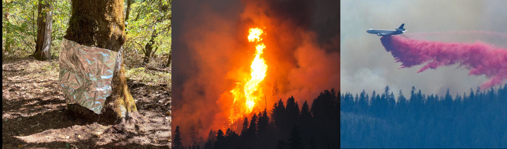
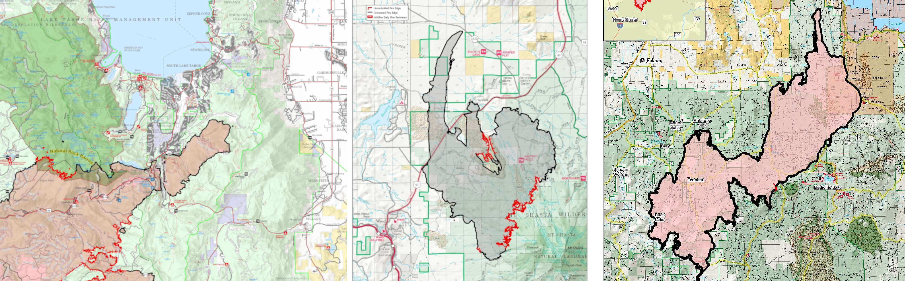

class: inverse, middle

```{r Setup, include = F}
options(htmltools.dir.version = FALSE)
library(pacman)
p_load(leaflet, ggplot2, ggthemes, viridis, dplyr, magrittr, knitr, gapminder, av, gganimate(), emo, ggdag, dagitty, data.table)
# Define pink color
#red_pink <- "#e64173"
#red_pink <- "#e64173"
turquoise <- "#20B2AA"
orange <- "#FFA500"
red <- "#fb6107"
blue <- "#f92772"
green <- "#8bb174"
grey_light <- "grey70"
grey_mid <- "grey50"
grey_dark <- "grey20"
purple <- "#6A5ACD"
slate <- "#314f4f"
# Notes directory
dir_slides <- "/Users/connor/Desktop/GithubProjects/Econometrics/EC421/Spring2021/LectureNotes/01-intro/"
# Knitr options
opts_chunk$set(
  comment = "#>",
  fig.align = "center",
  fig.height = 7,
  fig.width = 10.5,
  # dpi = 300,
  # cache = T,
  warning = F,
  message = F
)


```

```{css, echo = F}
@media print {
  .has-continuation {
    display: block !important;
  }
}
```


# Speed-trial

---
class: clear



.footnote[*McCash fire, threatening California Seqouia: Inciweb, September 16, 2021*]

<br />

.center[.bigger[Over the last ten years, the US has spent .hi[21.4] billion 2010 dollars on fire suppression]]

.center[.bigger[Is this the correct amount? .hi-orange[How would we know?]]]

---
class: clear

```{r, echo = F}
p_load(magrittr)

dfwui = data.frame(wui = c(30782682, 36946860, 43434112), years = c(1990,2000,2010))

dffs = data.frame(fs_cost = c(397952000,206120000,377466000,240436000,918335000,477126000,701183000,284148000, 416704000,515516000,1410802000,952696000,1674040000,1327138000,1007244000, 818954000, 1704477000, 1620145000,1585856000,920529000,809499000,1374525000), years = c(1990:2011))

dfwui %<>% mutate(wui_nrm = (wui - mean(wui))/sd(wui), wuith = wui/100)
dffs %<>% mutate(fs_cost_nrm = (fs_cost - mean(fs_cost))/sd(fs_cost), fsth = fs_cost/1000)

ggplot(data = dffs, aes(x = years, y = fsth)) + geom_line(aes(colour = 'Total Fire Suppression ($1000)')) + geom_line(data = dfwui, aes(y = wuith, colour ='Homes in WUI (100)' )) + theme_minimal()+ scale_y_discrete(labels = NULL, breaks = NULL) + labs(y = "", x = 'Year', caption = "WUI: Wildland Urban Interface. \n Fire suppression data from NIFC \n Home-ownership data from Radeloff et al. (2019) supplemental content") + scale_color_manual(name = '', labels = c("Homes in WUI (100\'s of homes)", 'Total Fire Suppression (1000$)'),values=c('#24E0A3','#E04524'))
```
### Fires are getting more expensive to fight as time goes on

---
# [2] What is .hi-orange[causing] these higher costs?

What makes fires .hi-slate[more] or .hi-slate[less] expensive to suppress in the first place?

Big concern of public policy is an observed link between .hi-orange[property values] and expense of fires

Understanding of mechanisms behind variation in .hi[cross-sectional] suppression expenditures (eg, fuel, elevation, water) crucial.

.pull-right[Also a dynamic time component. Which paths a fire could take impact expected costs. Suppression decisions impact actual paths AND costs, and expected paths affect suppression decisions, homes at risk and costs. **Simultaneity** problem]

.pull-left[
```{r, echo = F}
p_load(magrittr, scico)

df = data.frame(x = c(0:5), y = c(0:5))
                
paths = data.frame(p1x = c(2.5,2.5,3,3), p1y = c(2.5,3,4,5), p2x = c(2.5,1,0,0), p2y = c(2.5,2.5,1,1), p3x = c(2.5,3.5,4.5,4.5), p3y = c(2.5,1,0,0))

p1 = ggplot(data = df, aes(x = x, y = y)) + geom_rect(xmin = 2.25, xmax = 2.75, ymin = 2.25, ymax = 2.75, fill = orange, alpha = .3) + geom_rect(xmin = 1.00, xmax = 1.9, ymin = 1, ymax = 2.1, fill = green, alpha = .3) +  geom_label(x = 1.45, y = 1.55, label = 'W.U.I.', color = green) +  geom_rect(xmin = 0, xmax = 5, ymin = 0, ymax = 5, fill = 'dark grey', color = 'grey', alpha = .01) + geom_path(data = paths, aes(x = p1x, y = p1y, color = 'Suppression = $10,000')) + geom_path(data = paths, aes(x = p2x, y = p2y, color = 'Suppression = $1,000,000')) + geom_path(data = paths, aes(x = p3x, y = p3y, color = 'Suppression = $100,000')) + theme_minimal()+ scale_y_discrete(labels = NULL) + scale_x_discrete(labels = NULL) + labs(title = 'Potential Fire Paths', subtitle = 'Affect on suppression expenditure', y = "", x = '', caption = "Orange square is ignition location \n Green rct. represents WUI neighborhood \n lines represent potential fire paths") + scale_color_scico_d(name = '', labels = c('Fire path 1: Suppression = $1,000,000','Fire path 2: Suppression = $10,000' , 'Fire path 3: Suppression = $100,000'), palette = "roma") + theme(legend.text=element_text(size=15), plot.caption = element_text(size = 15), plot.title= element_text(size = 15), plot.subtitle = element_text(size = 12))

p2 = ggplot(data = df, aes(x = x, y = y)) + geom_rect(xmin = 2.25, xmax = 2.75, ymin = 2.25, ymax = 2.75, fill = orange, alpha = .3) + geom_rect(xmin = .00, xmax = .9, ymin = 1, ymax = 2.1, fill = green, alpha = .3) +  geom_label(x = 1.45, y = 1.55, label = 'W.U.I.', color = green) +  geom_rect(xmin = 0, xmax = 5, ymin = 0, ymax = 5, fill = 'dark grey', color = 'grey', alpha = .01) + geom_path(data = paths, aes(x = p1x, y = p1y, color = 'Suppression = $10,000')) + geom_path(data = paths, aes(x = p2x, y = p2y, color = 'Suppression = $1,000,000')) + geom_path(data = paths, aes(x = p3x, y = p3y, color = 'Suppression = $100,000')) + theme_minimal()+ scale_y_discrete(labels = NULL) + scale_x_discrete(labels = NULL) + labs(title = 'Potential Fire Paths', subtitle = 'Affect on suppression expenditure', y = "", x = '', caption = "Orange square is ignition location \n Green rct. represents WUI neighborhood \n lines represent potential fire paths") + scale_color_scico_d(name = '', labels = c('Fire path 1: Suppression = $1,000,000','Fire path 2: Suppression = $10,000' , 'Fire path 3: Suppression = $100,000'), palette = "roma") + theme(legend.text=element_text(size=15), plot.caption = element_text(size = 15), plot.title= element_text(size = 15), plot.subtitle = element_text(size = 12))

p3 = ggplot(data = df, aes(x = x, y = y)) + geom_rect(xmin = 2.75, xmax = 3.25, ymin = 2.25, ymax = 2.75, fill = orange, alpha = .3) + geom_rect(xmin = 1.00, xmax = 1.9, ymin = 0, ymax = 1.1, fill = green, alpha = .3) +  geom_label(x = 1.45, y = 1.55, label = 'W.U.I.', color = green) +  geom_rect(xmin = 0, xmax = 5, ymin = 0, ymax = 5, fill = 'dark grey', color = 'grey', alpha = .01) + geom_path(data = paths, aes(x = p1x, y = p1y, color = 'Suppression = $10,000')) + geom_path(data = paths, aes(x = p2x, y = p2y, color = 'Suppression = $1,000,000')) + geom_path(data = paths, aes(x = p3x, y = p3y, color = 'Suppression = $100,000')) + theme_minimal()+ scale_y_discrete(labels = NULL) + scale_x_discrete(labels = NULL) + labs(title = 'Potential Fire Paths', subtitle = 'Affect on suppression expenditure', y = "", x = '', caption = "Orange square is ignition location \n Green rct. represents WUI neighborhood \n lines represent potential fire paths") + scale_color_scico_d(name = '', labels = c('Fire path 1: Suppression = $1,000,000','Fire path 2: Suppression = $10,000' , 'Fire path 3: Suppression = $100,000'), palette = "roma") + theme(legend.text=element_text(size=15), plot.caption = element_text(size = 15), plot.title= element_text(size = 15), plot.subtitle = element_text(size = 12))

p1
#values=c('#24E0A3','#E04524', 'grey'))
```
]
---
# [2] Government & Suppression


<br />
<br />
<br />

.center[**Policy failure**]
.smallest[*"Wildland fires constitute a major crisis in American environmental policy, a crisis created by a longstanding policy failure."* - Busenburg, 2004 RPR]

---
# [2] Government & Suppression

Some evidence in existing literature that this money disproportionately benefits the wealthy. .hi-slate[*]

.footnote[.hi-slate[*]: See Wibbenmeyer, WP or Boomhower & Baylis, 2020]

Expensive private homes in WUI are prone to fire risk. 

- Expensive homes are owned by wealthier individuals

- Those at-risk homes benefit more from suppression dollars than cheaper, less-at-risk homes

This is .hi-orange[extremely regressive!]

Fire suppression is essentially a multi-billion dollar home-insurance underwriting program for wealthy individuals.

---
# [3] Outline

.hi-slate[Research goal:] decompose the fire manager's problem.

.hi-slate[*Q<sub>1</sub>*] Do fire managers **actually** preferentially assign resources to fires near more expensive properties?

.hi-slate[*Q<sub>2</sub>*] Or...  just correlation between fire suppression and property values due to physical attributes common to expensive properties and higher suppression costs.

.hi[Methods]: Double/Debiased Machine Learning 

- Uses **CCT** to model nuisance functions $\eta = \{g(x), f(x)\}$ 

- Produces causal estimates of property value on fire suppression costs, conditional on machine learned fire risk attributes

---
# [3] Example: Lake Tahoe

.center[.slate[*Q*:] Does Fire 1 get more resources than fire 2 or 3?]

&nbsp; **Fire 1**   &nbsp; &nbsp;   &nbsp; &nbsp;&nbsp; &nbsp;   &nbsp; &nbsp;   &nbsp; &nbsp;   &nbsp; &nbsp;  &nbsp; &nbsp;   &nbsp; &nbsp;   &nbsp; &nbsp;    **Fire 2** &nbsp;  &nbsp;  &nbsp; &nbsp; &nbsp; &nbsp;   &nbsp; &nbsp;  &nbsp; &nbsp;   &nbsp; &nbsp; **Fire 3**



.center[.slate[*Follow up Q*]: Is it because Lake Tahoe has more expensive homes?]

All: Near lakes and Threaten some homes


---
# [4] Research Question

### Do higher property values cause higher supp. costs?

```{r, prob, include = F}
# The full DAG
p_load(dagitty, dagify)
ex5 = dagify(
  Supp ~ H.P,
  coords = tibble(
    name = c("Supp", "H.P", "Rsk", "Amn", "Envr"),
    x = c(0, 2, 0, 2, 1),
    y = c(0, 0, 2, 2, 2)
  )
)
# Convert to data.table
ex5 %<>% fortify() %T>% setDT()
# Shorten segments
mult = 0.2
ex5[, `:=`(
  xa = x + (xend-x) * (mult),
  ya = y + (yend-y) * (mult),
  xb = x + (xend-x) * (1-mult),
  yb = y + (yend-y) * (1-mult)
)]
```

```{r, probfig, echo = F, fig.height = 6, fig.width = 9}
ggplot(
  data = ex5,
  aes(x = x, y = y, xend = xend, yend = yend)
) +
geom_point(
  size = 20,
  fill = "white",
  color = slate,
  shape = 21,
  stroke = 0.6
) +
geom_curve(
  aes(x = xa, y = ya, xend = xb, yend = yb),
  curvature = 0,
  arrow = arrow(length = unit(0.07, "npc")),
  color = slate,
  size = .8,
  lineend = "round"
) +
geom_text(
  data = . %>% .[,.(name,x,y,xend=x,yend=y)] %>% unique(),
  aes(x = x, y = y, label = name),
  family = "Fira Sans Medium",
  size = 5,
  color = red
) +
theme_void() +
theme(
  legend.position = "none",
) +
coord_cartesian(
  xlim = ex5[,range(x)] + ex5[,range(x) %>% diff()] * c(-0.08, 0.08),
  ylim = ex5[,range(y)] + ex5[,range(y) %>% diff()] * c(-0.08, 0.08)
)
```
---
# [4] Basic Hedonics

### We know environment plays role in housing prices

```{r, prob2, include = F}
# The full DAG
p_load(dagitty, dagify)
ex5 = dagify(
  Supp ~ H.P,
  Amnty ~ Envir,
  H.P ~ Amnty,
  coords = tibble(
    name = c("Supp", "H.P", "FireRsk", "Amnty", "Envir"),
    x = c(0, 2, 0, 2, 1),
    y = c(0, 0, 2, 2, 2)
  )
)
# Convert to data.table
ex5 %<>% fortify() %T>% setDT()
# Shorten segments
mult = 0.2
ex5[, `:=`(
  xa = x + (xend-x) * (mult),
  ya = y + (yend-y) * (mult),
  xb = x + (xend-x) * (1-mult),
  yb = y + (yend-y) * (1-mult)
)]
```

```{r, prob2fig, echo = F, fig.height = 6, fig.width = 9}
ggplot(
  data = ex5,
  aes(x = x, y = y, xend = xend, yend = yend)
) +
geom_point(
  size = 20,
  fill = "white",
  color = slate,
  shape = 21,
  stroke = 0.6
) +
geom_curve(
  aes(x = xa, y = ya, xend = xb, yend = yb),
  curvature = 0,
  arrow = arrow(length = unit(0.07, "npc")),
  color = slate,
  size = .8,
  lineend = "round"
) +
geom_text(
  data = . %>% .[,.(name,x,y,xend=x,yend=y)] %>% unique(),
  aes(x = x, y = y, label = name),
  family = "Fira Sans Medium",
  size = 5,
  color = red
) +
theme_void() +
theme(
  legend.position = "none",
) +
coord_cartesian(
  xlim = ex5[,range(x)] + ex5[,range(x) %>% diff()] * c(-0.08, 0.08),
  ylim = ex5[,range(y)] + ex5[,range(y) %>% diff()] * c(-0.08, 0.08)
)
```
---
# [4] Basic Physics

### Well known environment plays role in fire risk

```{r, prob3, include = F}
# The full DAG
p_load(dagitty, dagify)
ex5 = dagify(
  Supp ~ H.P,
  Supp ~ FireRsk,
  FireRsk ~ Envir,
  Amnty ~ Envir,
  H.P ~ Amnty,
  coords = tibble(
    name = c("Supp", "H.P", "FireRsk", "Amnty", "Envir"),
    x = c(0, 2, 0, 2, 1),
    y = c(0, 0, 2, 2, 2)
  )
)
# Convert to data.table
ex5 %<>% fortify() %T>% setDT()
# Shorten segments
mult = 0.2
ex5[, `:=`(
  xa = x + (xend-x) * (mult),
  ya = y + (yend-y) * (mult),
  xb = x + (xend-x) * (1-mult),
  yb = y + (yend-y) * (1-mult)
)]
```

```{r, prob3fig, echo = F, fig.height = 6, fig.width = 9}
ggplot(
  data = ex5,
  aes(x = x, y = y, xend = xend, yend = yend)
) +
geom_point(
  size = 20,
  fill = "white",
  color = slate,
  shape = 21,
  stroke = 0.6
) +
geom_curve(
  aes(x = xa, y = ya, xend = xb, yend = yb),
  curvature = 0,
  arrow = arrow(length = unit(0.07, "npc")),
  color = slate,
  size = .8,
  lineend = "round"
) +
geom_text(
  data = . %>% .[,.(name,x,y,xend=x,yend=y)] %>% unique(),
  aes(x = x, y = y, label = name),
  family = "Fira Sans Medium",
  size = 5,
  color = red
) +
theme_void() +
theme(
  legend.position = "none",
) +
coord_cartesian(
  xlim = ex5[,range(x)] + ex5[,range(x) %>% diff()] * c(-0.08, 0.08),
  ylim = ex5[,range(y)] + ex5[,range(y) %>% diff()] * c(-0.08, 0.08)
)
```

---
# [4] Fire Manager Info Set

### Fire Manager Pre-plans actions

```{r, prob4, include = F}
# The full DAG
p_load(dagitty, dagify)
ex5 = dagify(
  Supp ~ H.P,
  Supp ~ FireRsk,
  FireRsk ~ Envir,
  Amnty ~ Envir,
  H.P ~ Amnty,
  Ex.Supp ~ H.P,
  Ex.Supp ~ FireRsk,
  Ex.Supp ~ Amnty,
  Ex.Supp ~ Envir,
  Supp ~ Ex.Supp,
  coords = tibble(
    name = c("Supp", "H.P", "FireRsk", "Amnty", "Envir", "Ex.Supp"),
    x = c(0, 2, 0, 2, 1, 1),
    y = c(0, 0, 2, 2, 2, 1)
  )
)
# Convert to data.table
ex5 %<>% fortify() %T>% setDT()
# Shorten segments
mult = 0.2
ex5[, `:=`(
  xa = x + (xend-x) * (mult),
  ya = y + (yend-y) * (mult),
  xb = x + (xend-x) * (1-mult),
  yb = y + (yend-y) * (1-mult)
)]
```

```{r, prob4fig, echo = F, fig.height = 6, fig.width = 9}
ggplot(
  data = ex5,
  aes(x = x, y = y, xend = xend, yend = yend)
) +
geom_point(
  size = 20,
  fill = "white",
  color = slate,
  shape = 21,
  stroke = 0.6
) +
geom_curve(
  aes(x = xa, y = ya, xend = xb, yend = yb),
  curvature = 0,
  arrow = arrow(length = unit(0.07, "npc")),
  color = slate,
  size = .8,
  lineend = "round"
) +
geom_text(
  data = . %>% .[,.(name,x,y,xend=x,yend=y)] %>% unique(),
  aes(x = x, y = y, label = name),
  family = "Fira Sans Medium",
  size = 5,
  color = red
) +
theme_void() +
theme(
  legend.position = "none",
) +
coord_cartesian(
  xlim = ex5[,range(x)] + ex5[,range(x) %>% diff()] * c(-0.08, 0.08),
  ylim = ex5[,range(y)] + ex5[,range(y) %>% diff()] * c(-0.08, 0.08)
)
```

---
class: clear


.hi[Q:] What do we need to identify how much of .hi-slate[home 1 or 2's] prices comes from risk-correlated amenities?

.hi[&#x2611;] .hi-slate[GOAL:] Disentangle the physical components of expected fire suppression costs from the human/bias-driven tendency to protect expensive property.

.hi[A:] We'd need an algorithm that can simultaneously combine short and long-distance dependencies of amenity sets on... elevation, fuels, water-features, telephone, etc. .hi-orange[Enter ViT] (Really **CCT**)

---
# [5] Basics of D/DML

.smaller[Can't just use ML OR OLS in a causal pipeline without thought (particularly one with simultaneity bias). Based on SCM, need to control for all variables]

.smaller[**But** those variables represent millions of pixels per fire, at a minimum. Need to learn the data **manifold**]

.smaller[**D/DML** allows us to use out of sample estimates from a ML algorithm to estimate a causal effect property val. on suppression, controlling for lower-dimensional functions of X.]

--


$$\theta \equiv param\ of\ interest,\ X \equiv \{Rsk, Envr, Amn, Ex.Supp\}$$
$$Supp = \theta H.P + g(X) + \varepsilon_1$$
$$H.P = f(X) + \varepsilon_2$$ 
$$\eta_0 = \{\hat{f}(X), \hat{g}(X)\}$$

---
# [5] My methods

Collect raster data on .smaller[fuels, historic fires, .smaller[elevation, summed home values (block level)]], .smaller[.smallest[weather, communication towers, .smallest[accessibility level]]]... etc (31 different raster inputs!)

.smaller[Use double-debiased ml with a **vision transformer** on 1750 fires over the 2020 and 2021 fire seasons]

.smaller[- estimate the causal effect of 20km radius property values on suppression costs. (so far)]

--

.smaller[Turns out: .hi[point estimates] miss a lot of the important variation in fuels, elevation and amenity sets that may pollute estimates.]

.smaller[Prelim results: .hi-orange[.03817], 95% - CI = .hi-orange[[-.02577, .1021]] vs. original estimate of .hi-slate[[.1131]]]

--

.smaller[Repeating original procedure on my fire data - .hi-slate[[estimate = .1606, SE = .0322]]]

---
# [6] Work to do

**Presentations** - need to work on this. Plan to present at economic micro group and metrics group

**Drafts** - an early draft done by mid october. I hope to circulate this draft to my committee, and have offers to get feedback from Matthew Wibbenmeyer and Margaret Walls. Depending on feedback, third draft, followed by final draft.

**Defended** April 1st, 2022.

---
# [6] Work to do

Need to run full model on all 10 folds (as of now, only applied to one fold, but results are strong)

--

Potentially repeat procedure for building-assigned income by tract? If of interest.

--

Likely useful to do some degree of ablation tests for my version of CCT.

--

Others?

---
exclude: true

```{R, print pdfs, echo = F, eval = T}
pagedown::chrome_print(input = "5-slide-deck-SCI-2-nopause.html")
```

