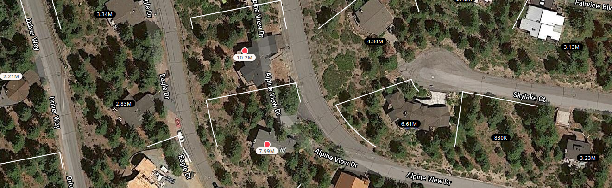

class: inverse, middle

```{r Setup, include = F}
options(htmltools.dir.version = FALSE)
library(pacman)
p_load(leaflet, ggplot2, ggthemes, viridis, dplyr, magrittr, knitr, gapminder, av, gganimate(), emo, ggdag, dagitty, data.table)
# Define pink color
#red_pink <- "#e64173"
#red_pink <- "#e64173"
turquoise <- "#20B2AA"
orange <- "#FFA500"
red <- "#fb6107"
blue <- "#f92772"
green <- "#8bb174"
grey_light <- "grey70"
grey_mid <- "grey50"
grey_dark <- "grey20"
purple <- "#6A5ACD"
slate <- "#314f4f"
# Notes directory
dir_slides <- "/Users/connor/Desktop/GithubProjects/Econometrics/EC421/Spring2021/LectureNotes/01-intro/"
# Knitr options
opts_chunk$set(
  comment = "#>",
  fig.align = "center",
  fig.height = 7,
  fig.width = 10.5,
  # dpi = 300,
  # cache = T,
  warning = F,
  message = F
)


```

```{css, echo = F}
@media print {
  .has-continuation {
    display: block !important;
  }
}
```


# Speed-trial

---
# Suppression Costs are Rising


.center[.smaller[.smaller[.smaller[*McCash fire, threatening California Seqouia: Inciweb, September 16, 2021*]]]]

.pull-left[2010-2015 suppression costs: .hi[9] __*__  billion .smaller[(8,991,602,998)]]

.pull-right[2015-2020 suppression costs: .hi-orange[12] __*__  billion .smaller[(12,404,288,314)]]

.pull-left[.footnote[ __*__ : in 2010 dollars]]

---
# Rising Costs

.center[*What is .hi-slate[causing] this rising rate of costs?*]

--

.more-right[.pull-right[**Migration to WUI?**.hi[*]]]

.footnote[.hi[*] WUI: .hi[W]ildland .hi[U]rban .hi[I]nterface]

.pull-left[**Climate Change?**]

<br />


.pull-left[.center[These are .hi-orange[Time Series Questions],]]


--

but let's take a step back:

--

Why are fires .hi-slate[more] or .hi-slate[less] expensive to suppress in the first place?

--

I argue: we don't have a solid understanding of mechanisms behind variation in .hi[cross-sectional] expenditures.

--

Before we can understand a forecast of wildfire expenditures, we first need to understand why those expenditures fluctuate.

---
# Government & Suppression

Long, troubled history of forest service & fire suppression. 1910 "Big Blowup"

.smallest[.smallest[- .smallest[*"Wildland fires constitute a major crisis in American environmental policy, a crisis created by a longstanding policy failure."* - Busenburg, 2004 RPR]]]

--

Should Government be entirely responsible for this? 

--

Some evidence in existing literature that this money disproportionately benefits the wealthy. .hi-slate[*]

.footnote[.hi-slate[*]: See Wibbenmeyer, WP or Boomhower & Baylis, 2020]

--

Expensive private homes in WUI are prone to fire risk. 
--
This is .hi-orange[extremely] regressive!

--

Fire policy researchers are concerned suppression represents a multi-billion dollar home-insurance underwriting for wealthy individuals.

---
# What

Before returning to consider the future budgetary concern fire suppression represents for the United States, we need to consider the fire manager's problem.

--

.hi-slate[*Q*] Do fire managers **actually** preferentially assign resources to fires near more expensive properties?

--

.hi-slate[*Q*] Or... 
--
just correlation between fire suppression and property values due to physical attributes common to expensive properties and higher suppression costs.

--

.hi[Why?] It's critical to have a complete understanding of suppression costs within a fire season to understand how and why future forecasts may fail.

--

.hi[Good] causal estimates should be invariant to changes in environment.

---
# Suppression Costs

.hi-slate[What are they?] 

--

Costs come from: 

--

.smallest[fuel for vehicles, contract fees (wages), planes, helicopters, trucks, coordination, materials (water, chemical retardant, radios, parachutes, tinfoil **(?!)**)]

--

.hi-slate[Note:] none of these are tied to property values directly.

--

To tease out ideal experiment for effect of property values on suppression costs, have us vary property values randomly, holding fixed environmental amenities (eg, fuels, elevation) and measure variation in suppression costs.

--

.hi[Obviously infeasible.] Need to approximate. Standard practice, (SCI - Gebert et al. 2007) would be subject to .hi-orange[classic] OVB

---
# Ideal 'Experiment'

Use statistics to control for conditional fire risk factors of concern (canopy height, wind, fuel density, fuel class, slope)

--

.hi[But...]
--
 this is a much harder collection of factors to adjust for than it sounds.
 
--

**1.)** What locations are truly 'alike' in terms of fire risk, conditional on ignition location?

--

**2.)** What locations are truly 'alike' in terms of amenities?

---
# Example: Lake Tahoe

.slate[*Q*:] Do fires impacting home 1 get more resources than one impacting home 2?

.center[.hi-slate[Home 1] | .hi-slate[Home 2]]

.cent[]

--

.center[]

---
# Motivation

.pull-right[]

.hi[Q:] What do we need to identify how much of .hi-slate[home 1 or 2's] prices comes from risk-correlated amenities?

--

<br />

.hi-slate[GOAL:] Disentangle the physical components of expected fire suppression costs from the human/bias-driven tendency to protect expensive property.

.hi[A:] We'd need an algorithm that can simultaneously combine short and long-distance dependencies of... 

elevation, fuels, water-features, telephone, etc. in a way that does a good job of matching amenity sets to one another.

--

We'd also want to fit those same variables to understand how they cause changes in conditional risk! How do we do this?

--
.hi-orange[Enter ViT] (Really **CCT**)

---
# D/DML

Can't just use ML in a causal pipeline without thought. Need to understand the .hi[system] in which the causal estimate exists.

--

Combining multi-factor models of fire spread in the WUI, fire suppression and a loose amenities, create a structural causal model.  

--

From LANDFIRE, WFDSS, Irwin, census, NCEP-NCAR...

--

Collect raster data on .smaller[fuels, historic fires, .smaller[elevation, summed home values (block level)]], .smaller[.smallest[weather, communication towers, .smallest[accessibility level]]]... etc (31 different raster inputs!)

---
# D/DML

Use double-debiased ml with a **vision transformer** on 1750 fires over the 2020 and 2021 fire seasons 

- estimate the causal effect of 20km radius property values. (so far)

--

Turns out: .hi[point estimates] miss a lot of the important variation in fuels, elevation and amenity sets that may pollute estimates.

Prelim results: .hi-orange[.03817], 95% - CI = .hi-orange[[-.02577, .1021]] vs. original estimate of .hi-slate[[.1131]]

--

Repeating original procedure on my fire data - .hi-slate[[estimate = .1606, SE = .0322]]

--

Substantially different implication of these point estimates.

---
# Work to do

**Presentations** - need to work on this. Plan to present at economic micro group and metrics group

**Drafts** - an early draft done by mid october. I hope to circulate this draft to my committee, and have offers to get feedback from Matthew Wibbenmeyer and Margaret Walls. Depending on feedback, third draft, followed by final draft.

**Defended** April 1st, 2022.

---
# Work to do

Need to run full model on all 10 folds (as of now, only applied to one fold, but results are strong)

--

Potentially repeat procedure for building-assigned income by tract? If of interest.

--

Likely useful to do some degree of ablation tests for my version of CCT.

--

Others?

---
exclude: true

```{R, print pdfs, echo = F, eval = T}
#pagedown::chrome_print(input = "5-slide-deck-SCI.html")
```

