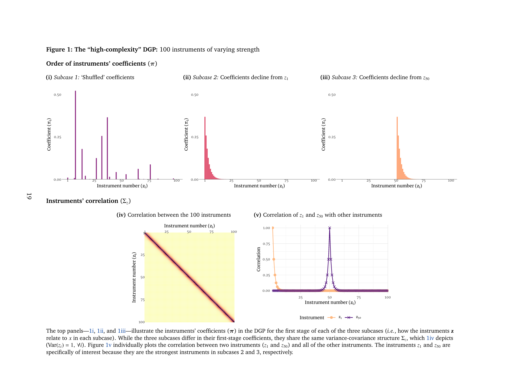
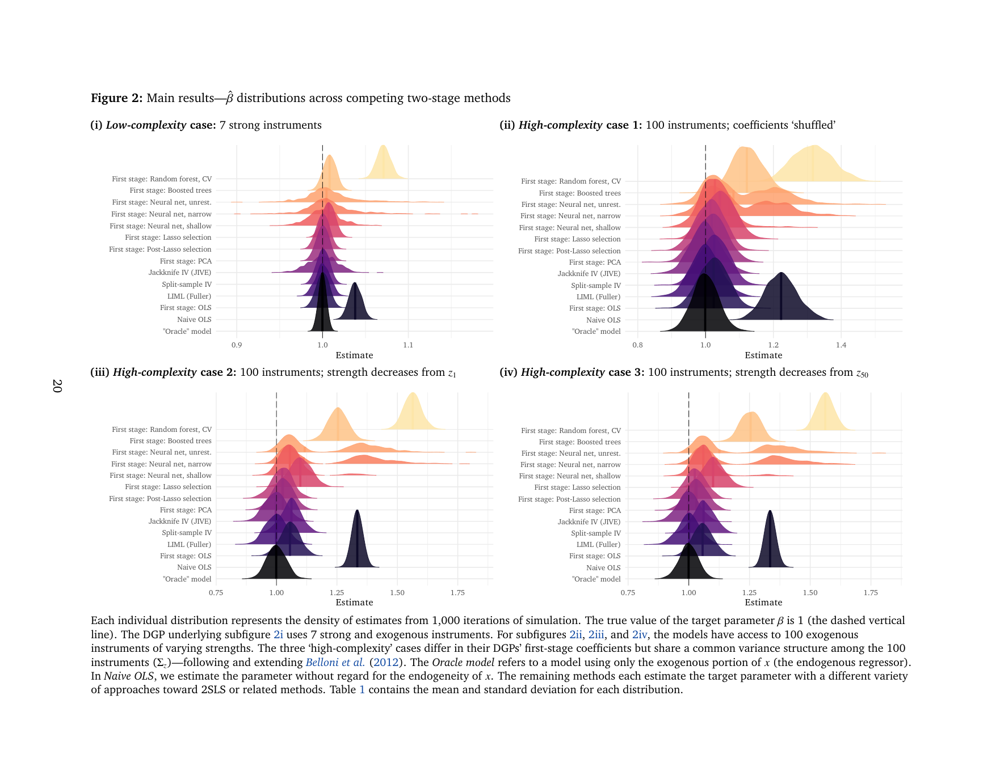
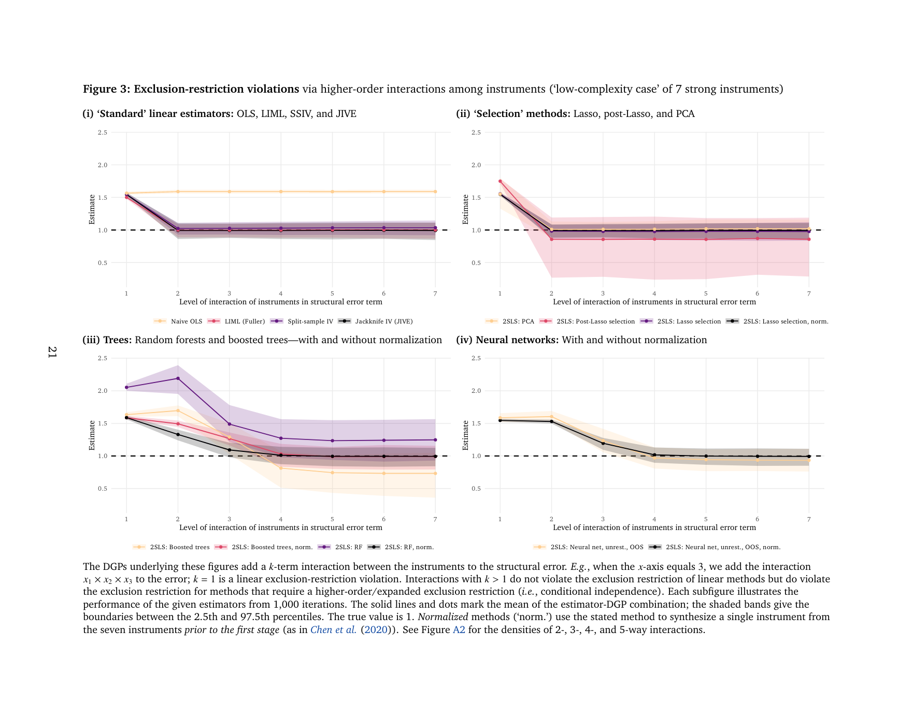

class: inverse, middle

```{r Setup, include = F}
options(htmltools.dir.version = FALSE)
library(pacman)
p_load(leaflet, ggplot2, ggthemes, viridis, dplyr, magrittr, knitr, gapminder, av, gganimate(), emo, ggdag, dagitty, data.table)
# Define pink color
red_pink <- "#e64173"
red_pink <- "#e64173"
turquoise <- "#20B2AA"
orange <- "#FFA500"
red <- "#fb6107"
blue <- "#3b3b9a"
green <- "#8bb174"
grey_light <- "grey70"
grey_mid <- "grey50"
grey_dark <- "grey20"
purple <- "#6A5ACD"
slate <- "#314f4f"
# Notes directory
dir_slides <- "/Users/connor/Desktop/GithubProjects/Econometrics/EC421/Spring2021/LectureNotes/01-intro/"
# Knitr options
opts_chunk$set(
  comment = "#>",
  fig.align = "center",
  fig.height = 7,
  fig.width = 10.5,
  # dpi = 300,
  # cache = T,
  warning = F,
  message = F
)
```

```{css, echo = F}
@media print {
  .has-continuation {
    display: block !important;
  }
}
```


# Introduction

---
# MLIV

### Machine Learning in Applied Econometrics

For econometric applications, there is increasing interest in using machine learning for

--

- .hi[Paper Marketability]: machine learning application may increase interest

--

- .hi-purple[Better Predictors]: Many targets will be better predicted by some ML algorithm.

--

**This thing**:

.hi[Q] "Running into trouble?" 

--

.hi[A] "Have you tried machine learning?"

---
# Intuition

## A promising angle

- Some ML tool might be able to boost the strength of a weak or set of weak instruments in first stage of 2SLS.

--

Despite the interest, much of the intuition from existing econometric methods doesn't map directly to using Machine Learning for causal queries.

--

.hi[Q] How does using out-of-the-box machine learning perform when predicting the first stage of 2SLS?

--

.hi-orange[A] Unpredictably.

---
# Intuition

Much of the assumptions around the first stage center around optimizing two narratives

--

1.) **Relevance**, ie, that your instrument has explanatory power `r emo::ji('check')`

--

2.) **Exogeneity**, which is generally spoken about in terms of correlations, ie, $corr(u,\textbf{z}) = 0$.

--

Machine learning in this context: 

- complicates the second 

- introduces two more.

---
# Intuition

Including .hi-purple[machine learning] introduces these further conundrums

-  .hi[Potentially Recovering endogeneity - overfitting] 

doubly dangerous in causal estimation

--

-  .hi-slate[Complex Exclusion restrictions]

The set of exclusion restrictions under consideration is much larger. 

Instead of  $corr(\varepsilon_i, \textbf{z}) = 0$, need $E(\varepsilon_i|\textbf{z}) = 0$.

--

-  .hi-orange[Inflates Bias] 

Bias-variance tradeoff can lead to inflated coefficients in the second stage of 2SLS if variance-reduction is primary strategy.

--

__Takeaway:__ Using past applied econometric findings & ML more challenging.

--

__Approach:__ We run a monte-carlo simulation on several synthetic datasets

__find:__ using machine learning under classic assumptions can lead to worse than naive-OLS performance.

---
# Decomposition of Error

Suppose, for a moment, that we are interested in a simple linear IV estimate for causal parameter $\beta_1$, where x is (traditionally) endogenous
$$y = \beta_0 + \beta_1x + u$$
$$x = \beta_0 + \pi\mathbf{z} + w$$

$$cov(x,u) \neq 0$$
.hi[2SLS], produces the estimate

$\hat{\beta}_1^{2SLS} = \beta_1 + \frac{Cov(\hat{x}, w)}{Var(\hat{x})}$

--

- Where $\frac{Cov(\hat{x}, w)}{Var(\hat{x})}$ represents the bias

---
# Decomposition of Error

This term breaks down into an informative form-

$$\frac{Cov(\hat{x}, w)}{Var(\hat{x})} = \frac{\beta_1Cov(\hat{x},e) + Cov(\hat{x},u)}{Var(\hat{x})}$$
--

- In OLS, $\beta_1Cov(\hat{x},e)$ is mechanically 0, allowing for $Cov(\hat{x},u)$ to be assumed 0 given the estimating model.

--

- .hi-orange[However]: nonparametric estimate of the first stage makes no guarantees on $Cov(\hat{x},u)$

.footnote[given traditional assumptions.]

--

- Additionally, nonlinear first stages can produce non-orthogonal errors, meaning $\beta_1Cov(\hat{x},e) \neq 0$

---
# Term 1

$$Term_1 \equiv \beta_1Corr(\hat{x},e)$$
--

__Cases__

Econometrics has a very limited 'intuitional toolbox' because this term drops out in standard OLS.

--

The effect on bias can be digested into $Sign\{\beta_1\} \cdot Sign\{Corr(\hat{x},x)\sigma_x - \sigma_{\hat{x}}\}$

--

Quickly noticeable is that if the ML algorithm perfectly reproduces estimand $x$, this term is not of concern.

--

If we define a variance reduction strategy as 
$$min_{\hat{x}}\ \sigma_{\hat{x_s}},\ \hat{x_s} \in \hat{X}\ s.t. Corr(\hat{x_s}, x) \geq Corr(\hat{x}_{-s}, x, x)$$ 

variance reduction causes no bias at a ridge of fixed points that changes with the explanatory power of the algorithm & $\sigma_{\hat{x}}$

---
# Term 2

$$Term\ 2 \equiv Cov(\hat{x},u)$$
__Exogeneity__

.hi-purple[Exclusion Restriction]. 

OLS is linear in form, requires $Cov(\textbf{z}\hat{\beta}, u) = 0$ 

- (some) ML .hi[requires] $Cov(f(\textbf{z}), u)$ for any arbitrary functional form $f$.

--

__Conundrum__

This term leaves the practitioner with one of three tough choices

--

1.) Restrict the functional form of the ML procedure

--

2.) Extend the "Exclusion Restriction" 

- If we can believably strengthen $corr(\textbf{z}, e) = 0$ to $E(e|\textbf{z}) = 0$ then we are safer.

--

3.) Make big assumptions about ML's relationship to excludibility. .hi[*] 

.footnote[.hi[*] Leaving one at the mercy of the reviewer]

---
#Term 3

$$Term\ 3 \equiv \frac{1}{Var(\hat{x})}$$

Variance reduction, typically, is not a concern in OLS-2SLS (though OLS does reduce variance) because our intuition toolbox typically implies the numerator will be asmptotically 0.

--

In PLR-based.hi[*] .hi-purple[MLIV], many applications rely on a convergence approach to identification

- can result in an almost-IV situation outside of optimal conditions. 

- In these cases, variance reduction can lead to higher-than-naive bias, even under reasonable assumptions

.footnote[.hi[*] PLR: Partially Linear Regression]

--

Now, let's see how these perform on a variety of ML-reasonable datasets

---
# DGP

Follows *Belloni et al (2012)* with a few modifications

$$y \ \beta_0 + \beta_1x_1 + \varepsilon_y$$
$$x_1 = \mathbf{z \pi} + \varepsilon_v$$
$$\begin{align*} \\(\varepsilon_y,\, \varepsilon_v) &\sim N\!\left(0,\, \left[
  \begin{matrix}
    \sigma^2_y & \sigma_y \sigma_v\\
    \sigma_v \sigma_y & \sigma^2_v
  \end{matrix}\right] \right)~,
  \\\end{align*}$$

$$\begin{align*}\\\mathbf{z} &= \left[\begin{matrix} z_{1} & z_{2} & \cdots & z_{100} \end{matrix}\right] \sim N(\mathbf{0},\, \Sigma_{z})~,
  \\
  \Sigma_{z}{[j,j]} &= \text{Var}(z_{j}) = \sigma^2_j = 1, \enspace \forall j \in \{1,\, \dots,\, 100\}~, and
  \\
  \Sigma_{z}{[j,k]} &= \text{Cov}(z_{j},\, z_{k}) = \text{Cor}(z_{j},\, z_{k}) = 0.6^{|j-k|}, \enspace \forall (j,\,k) \in \{1,\ \dots,\, 100\}~.
 \end{align*}$$
 
 $$N = 1000$$
 
 $$Num. \ Simulations = 500$$
 
---
# DGP

$$x_1 = \mathbf{z \pi} + \varepsilon_v$$
__Original:__ $$\tilde{\pi_i} = .7^{i-1}$$

__Split:__ $$\pi_{50} > \pi_{51} > \cdots > \pi_{100} > \pi_{1} > \pi_{2} > \cdots > \pi_{49}$$

__Shuffled:__ Randomly shuffled in each iteration.

--

Models are cross-validated across 5 folds for hyperparameter fitting

--

.hi-orange[In-sample predictions] are used to fit $\hat{x}$ to $x$.

--

*Note:* Data outputs are not normalized to $N(0,1)$, which likely harms NNet performance somewhat here.

---
class: clear

.center[]

---
class: clear

.center[]

---
class: clear

.center[]

---
# Main Takeaways

The approximately linear models seem to produce .hi[less bias] than their nonlinear counterparts.

--

Models that rely on both nonlinear mappings and variance reduction (ensemble strategy), such as *Random Forest*

--

Simpler NNets perform better here, and cross-validation does have neural nets prefer simpler representation when allowed to cross-validate.

--

**Big point:** naively inserting ML into a 2SLS scenario without considering the functional causal model is **very dangerous.**

---
# Light

Not all is lost - many algorithms have been invented that intelligently incorporate ML into 2SLS.

--

Concern is incorporating the assumptions of those models into the econometric toolbox.

---
# Things to Do

## What things I think I need to complete

1.) Extend the decomposition to D/DML by Chernozhukov (2018).

2.) Maybe of interest to do a 'causally penalized' estimator for NNet

3.) Do an example where economists typically rely on 'intuitive exogeneity' rather than formal exogeneity, eg, synthetic Card instrument of distance from a university for education.

4.) Your suggestions?

---
# Thanks!
