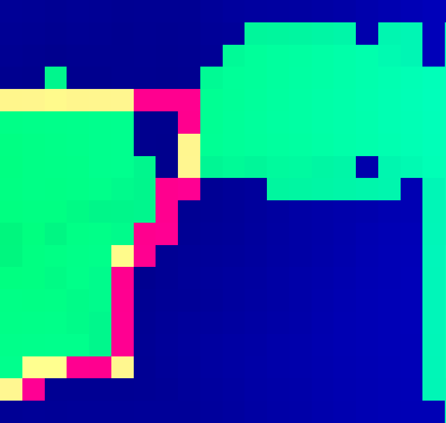

class: inverse, middle

```{r Setup, include = F}
options(htmltools.dir.version = FALSE)
library(pacman)
p_load(leaflet, ggplot2, ggthemes, viridis, dplyr, magrittr, knitr, gapminder, av, gganimate(), emo, ggdag, dagitty, data.table)
# Define pink color
#red_pink <- "#e64173"
#red_pink <- "#e64173"
turquoise <- "#20B2AA"
orange <- "#FFA500"
red <- "#fb6107"
blue <- "#f92772"
green <- "#8bb174"
grey_light <- "grey70"
grey_mid <- "grey50"
grey_dark <- "grey20"
purple <- "#6A5ACD"
slate <- "#314f4f"
# Notes directory
dir_slides <- "/Users/connor/Desktop/GithubProjects/Econometrics/EC421/Spring2021/LectureNotes/01-intro/"
# Knitr options
opts_chunk$set(
  comment = "#>",
  fig.align = "center",
  fig.height = 7,
  fig.width = 10.5,
  # dpi = 300,
  # cache = T,
  warning = F,
  message = F
)


```

```{css, echo = F}
@media print {
  .has-continuation {
    display: block !important;
  }
}
```


# Introduction

---
# What

## Fire Suppression Costs

US expenditures on wildfire suppression are increasing

--

.cent[]

.footnote[
Source: .hi[[Wildfire Today](https://wildfiretoday.com/2018/03/29/firefighting-costs-1985-2017/)]
]

--

There seems to be some evidence that this money disproportionately protects higher-income individuals - fairness concerns (Boomhower & Baylis (2020), Wibbenmeyer (WP)). We don't really understand why

--

__Important step:__ We need to actually unify a causal model and identify what we can learn


---
# What

.hi-orange[Long running trend] of cost increases. 

--

Cost-reduction has been a priority of the USFS since mid 1990s (Hand et al., 2014).

--

(Gebert et. al 2007.): created the .hi[Stratified Cost Index] (SCI).

- log-log regression

- Spread/value factors.hi[*] on suppression cost per acre.

--

Despite the simplicity, with few modifications, it is still in use

 - Main differences: new responsibility hierarchy, smaller regional buckets (FS region), still linear

.footnote[.hi[*]: Measured in distance buckets, summed (usually to 5km and 20km radii)]

---
# What

## Why

What does the SCI *understand* that other models have not?

--

The forest service has expert data-scientists who have experience with ML (prefer RF and their descendents).

--

- More data on fire spread, fire perimeters and firefighter actions

--

- __Arugment__: Including these data to predict costs is trickier:

Need to identify .hi[causal] linkages between spatial features and input variables

--

Leads to poor .hi-orange[OOD] performance at test time.

---
# Contribution

## Inspiration

Hedonic analysis of wildfire has some blind spots

__Goal__: combine functional models of amenities, spread and suppression effort into a single causal model

__Downside__: Disciplines have different preferences for units/validity concerns - no ability to .hi-orange[combine parametrically]

--

## Work

- Create a comprehensive causal graphical model of property values on fire suppression, and using a minimum adjustment set of spatially-explicit data as inputs...

--

- Exceeds.hi[*] OOS performance of the SCI (or the closest approximations I have found).hi-orange[&#10013;], with help from an adapted version of __CCT__

.footnote[.hi[*]: so far
.hi-orange[&#10013;]: On a wider range of fires]


---
# Contribution

## Methods and Early Results

Also: provides an estimate of the direct causal effect of property values on suppression costs

Using a technique from (Chernozhukov et al., 2018) called double/debiased machine learning which can learn complex nuisance functions.

--

Controlling for:

- Spatial distribution of .hi-orange[fuels]

- Non property .hi-purple[values at risk] 

- and a latent .hi[expected] burn-path

--

Impact of property value on suppression costs falls to 10-25% of existing model estimates

--

Is very close to $0$.hi[*].

.footnote[.hi[*]: so far]

---
# Why You Should Care

### Policy Responses to Inequality of Fire Suppression

**Q** If we implement zoning controls and that leads to increased housing prices, should we expect more expensive fire suppression?

--

.slate[Yes:] Fire managers seek to minimize damage $\rightarrow$ apply more expensive solutions to protect more expensive homes

.slate[No:] $\rightarrow$? Maybe zoning controls are minimally impactful

--

**Q:** How much are housing locations to blame for this? How much can we attribute this result to fire manager choices (on average)

--

.slate[A] We need .hi[intervention] to begin to parse this system

---
# The atmospheric overview

## Idea

- Hedonic analysis is predicated upon homes accumulating value through portfolios of amenities that buyers value

- Fire suppression tries to use as few resources as possible while preventing large amounts of damage.

--

- Strong evidence that environmental factors that contribute to fire risk increase individual home value, and spatially correlate

--

- Strong empirical evidence that prices are correlated with ease of access and cheaper/safer suppression for fire managers

---
# The atmospheric overview

## Models Involved

Hedonic analysis either assumes additively separable, iid .hi[amenities] or uses .hi-orange[first differences]

--

- Trees/views/accessibility have been estimated to effect utility in several studies: 

(Poudyal et al, 2010, Rodriguez & Sirmans 1994, Heyman & Pont, 2019).

--

But .hi[Wildfire scientists] have a good idea, on a variety of scales, the functional relationships for .hi-orange[fire spread] and .hi[damage].

--

Combine a rough .hi[graphical causal model] of hedonic amenity analysis 

--

with models of .hi-orange[fire suppression and spread] 

- identify variables we need to adjust for and use ML to learn control functions.

---
# What kind?

## Pearl's Causal Ladder

.smaller[What kind of causality is identifiable here?]

--

.smaller[1.) Prediction? 

$p(y|X=x)$ `r emo::ji("smile")`

- Been done. Many times over, in numerous ways - including using spatial data.]

--

.smaller[2.) Intervention?

$p(y|do(X=x))$ `r emo::ji("shrug")`

- Maybe - but we need a graphical/probabilistic model of cause and effect]

--

.smaller[3.) Counterfactual?

$p(Y = y_1|do(X=x)\ \&\ \hat{Y} = y_2)^1$ `r emo::ji("no")` 

- We'd need a functional causal model]

.footnote[1 A "clarifying" abuse of notation]

---
# Basics of D/DML

```{r, prob, include = F}
# The full DAG
p_load(dagitty, dagify)
ex5 = dagify(
  Supp ~ H.P,
  Supp ~ Rsk,
  Rsk ~ Envr,
  Amn ~ Envr,
  H.P ~ Amn,
  coords = tibble(
    name = c("Supp", "H.P", "Rsk", "Amn", "Envr"),
    x = c(0, 2, 0, 2, 1),
    y = c(0, 0, 2, 2, 2)
  )
)
# Convert to data.table
ex5 %<>% fortify() %T>% setDT()
# Shorten segments
mult = 0.2
ex5[, `:=`(
  xa = x + (xend-x) * (mult),
  ya = y + (yend-y) * (mult),
  xb = x + (xend-x) * (1-mult),
  yb = y + (yend-y) * (1-mult)
)]
```

```{r, probfig, echo = F, fig.height = 3, fig.width = 6}
ggplot(
  data = ex5,
  aes(x = x, y = y, xend = xend, yend = yend)
) +
geom_point(
  size = 20,
  fill = "white",
  color = slate,
  shape = 21,
  stroke = 0.6
) +
geom_curve(
  aes(x = xa, y = ya, xend = xb, yend = yb),
  curvature = 0,
  arrow = arrow(length = unit(0.07, "npc")),
  color = slate,
  size = .8,
  lineend = "round"
) +
geom_text(
  data = . %>% .[,.(name,x,y,xend=x,yend=y)] %>% unique(),
  aes(x = x, y = y, label = name),
  family = "Fira Sans Medium",
  size = 5,
  color = red
) +
theme_void() +
theme(
  legend.position = "none",
) +
coord_cartesian(
  xlim = ex5[,range(x)] + ex5[,range(x) %>% diff()] * c(-0.08, 0.08),
  ylim = ex5[,range(y)] + ex5[,range(y) %>% diff()] * c(-0.08, 0.08)
)
```

Illustrate the general idea of what is happening in a simplified version of the causal space:

- __Debiased/Double Machine Learning__ deals with a relaxation of the assumptions inherent in a linear regression setting for cases of complex 'nuisance functions'.

- Solves a version of __partially linear regression__...

---
# Basics of D/DML

```{r, probfig2, echo = F, fig.height = 3, fig.width = 6}
ggplot(
  data = ex5,
  aes(x = x, y = y, xend = xend, yend = yend)
) +
geom_point(
  size = 20,
  fill = "white",
  color = slate,
  shape = 21,
  stroke = 0.6
) +
geom_curve(
  aes(x = xa, y = ya, xend = xb, yend = yb),
  curvature = 0,
  arrow = arrow(length = unit(0.07, "npc")),
  color = slate,
  size = .8,
  lineend = "round"
) +
geom_text(
  data = . %>% .[,.(name,x,y,xend=x,yend=y)] %>% unique(),
  aes(x = x, y = y, label = name),
  family = "Fira Sans Medium",
  size = 5,
  color = red
) +
theme_void() +
theme(
  legend.position = "none",
) +
coord_cartesian(
  xlim = ex5[,range(x)] + ex5[,range(x) %>% diff()] * c(-0.08, 0.08),
  ylim = ex5[,range(y)] + ex5[,range(y) %>% diff()] * c(-0.08, 0.08)
)
```

- Solve for $\theta$ in the following system of equations

$$X \equiv \{Rsk, Envr, Amn\}$$
$$Supp = \theta H.P + g(X) + \varepsilon_1$$
$$H.P = f(X) + \varepsilon_2$$

---
# Basics of D/DML

```{r, partialout, include = F}
# The full DAG
ex5 = dagify(
  Supp ~ H.P,
  Supp ~ Rsk,
  Rsk ~ Envr,
  coords = tibble(
    name = c("Supp", "H.P", "Rsk", "Amn", "Envr"),
    x = c(0, 2, 0, 2, 1),
    y = c(0, 0, 2, 2, 2)
  )
)

ex5_2 = dagify(
  H.P ~ Amn,
  Amn~Envr,
  coords = tibble(
    name = c("Supp", "H.P", "Rsk", "Amn", "Envr"),
    x = c(0, 2, 0, 2, 1),
    y = c(0, 0, 2, 2, 2)
  )
)
# Convert to data.table
ex5 %<>% fortify() %T>% setDT()
ex5_2 %<>% fortify() %T>% setDT()
# Shorten segments
mult = 0.2
ex5[, `:=`(
  xa = x + (xend-x) * (mult),
  ya = y + (yend-y) * (mult),
  xb = x + (xend-x) * (1-mult),
  yb = y + (yend-y) * (1-mult)
)]
ex5_2[, `:=`(
  xa = x + (xend-x) * (mult),
  ya = y + (yend-y) * (mult),
  xb = x + (xend-x) * (1-mult),
  yb = y + (yend-y) * (1-mult)
)]
```

```{r, partialout.5, echo = F, fig.height = 3, fig.width = 6}
ggplot(
  data = ex5,
  aes(x = x, y = y, xend = xend, yend = yend)
) +
geom_point(
  size = 20,
  fill = "white",
  color = slate,
  shape = 21,
  stroke = 0.6
) +
geom_curve(
  aes(x = xa, y = ya, xend = xb, yend = yb),
  curvature = 0,
  arrow = arrow(length = unit(0.07, "npc")),
  color = slate,
  size = .8,
  lineend = "round"
) +
geom_text(
  data = . %>% .[,.(name,x,y,xend=x,yend=y)] %>% unique(),
  aes(x = x, y = y, label = name),
  family = "Fira Sans Medium",
  size = 5,
  color = red
) +
theme_void() +
theme(
  legend.position = "none",
) +
coord_cartesian(
  xlim = ex5[,range(x)] + ex5[,range(x) %>% diff()] * c(-0.08, 0.08),
  ylim = ex5[,range(y)] + ex5[,range(y) %>% diff()] * c(-0.08, 0.08)
) +
geom_point(data = ex5_2,
  size = 20,
  fill = "white",
  color = slate,
  shape = 21,
  stroke = 0.6,
  alpha = .2
) +
geom_curve(
  data = ex5_2,
  aes(x = xa, y = ya, xend = xb, yend = yb),
  curvature = 0,
  arrow = arrow(length = unit(0.07, "npc")),
  color = slate,
  size = .8,
  lineend = "round",
  alpha = .2
) +
geom_text(
  data = . %>% .[,.(name,x,y,xend=x,yend=y)] %>% unique(),
  aes(x = x, y = y, label = name),
  family = "Fira Sans Medium",
  size = 5,
  color = red
)
```


.center[*Sometimes you don't know* __U(tree)__]

--

Econometrics requires a __lot__ of structural/spatial knowledge to produce assumptions about $f(x)$ and $g(x)$

--

We don't know a lot about functional forms for how time-invariant amenities enter into homes - prefer nonparametric specifications.

--

In economic analysis, these are assumed to be captured by error terms, directly measured by WTP, part of home price, or estimated through choice experiments.

---
# Basics of D/DML

```{r, partialout1, include = F}
# The full DAG
ex5 = dagify(
  Supp ~ H.P,
  Amn ~ Envr,
  H.P ~ Amn,
  Supp ~ Rsk,
  Rsk ~ Envr,
  coords = tibble(
    name = c("Supp", "H.P", "Rsk", "Amn", "Envr"),
    x = c(0, 2, 0, 2, 1),
    y = c(0, 0, 2, 2, 2)
  )
)

ex5_2 = dagify(
Supp ~ H.P,
  coords = tibble(
    name = c("Supp", "H.P"),
    x = c(0, 2),
    y = c(0, 0)
  )
)
# Convert to data.table
ex5 %<>% fortify() %T>% setDT()
ex5_2 %<>% fortify() %T>% setDT()
# Shorten segments
mult = 0.2
ex5[, `:=`(
  xa = x + (xend-x) * (mult),
  ya = y + (yend-y) * (mult),
  xb = x + (xend-x) * (1-mult),
  yb = y + (yend-y) * (1-mult)
)]
ex5_2[, `:=`(
  xa = x + (xend-x) * (mult),
  ya = y + (yend-y) * (mult),
  xb = x + (xend-x) * (1-mult),
  yb = y + (yend-y) * (1-mult)
)]
```

```{r, partialout2, echo = F, fig.height = 3, fig.width = 6}
ggplot(
  data = ex5,
  aes(x = x, y = y, xend = xend, yend = yend)
) +
geom_point(
  size = 20,
  fill = "white",
  color = slate,
  shape = 21,
  stroke = 0.6,
  alpha = .2
) +
geom_curve(
  data = ex5,
  aes(x = xa, y = ya, xend = xb, yend = yb),
  curvature = 0,
  arrow = arrow(length = unit(0.07, "npc")),
  color = slate,
  size = .8,
  lineend = "round",
  alpha = .2
)  +
theme_void() +
theme(
  legend.position = "none",
) +
geom_point(data = ex5,
  size = 20,
  fill = "white",
  color = slate,
  shape = 21,
  stroke = 0.6
) +
geom_curve(
  data = ex5_2,
  aes(x = xa, y = ya, xend = xb, yend = yb),
  curvature = 0,
  arrow = arrow(length = unit(0.07, "npc")),
  color = slate,
  size = .8,
  lineend = "round"
) +
coord_cartesian(
  xlim = ex5[,range(x)] + ex5[,range(x) %>% diff()] * c(-0.08, 0.08),
  ylim = ex5[,range(y)] + ex5[,range(y) %>% diff()] * c(-0.08, 0.08)
)+
geom_text(
  data = ex5 %>% .[,.(name,x,y,xend=x,yend=y)] %>% unique(),
  aes(x = x, y = y, label = name),
  family = "Fira Sans Medium",
  size = 5,
  color = red
)
```

Instead, we can solve the inverse problem. Treat $\hat{g}$ and $\hat{f}$ as prediction problems, then difference-out effects.

--

Avoid untestable structural assumptions about relationship of $X$ to $Supp$ or $H.P$

Use a functionally appropriate machine learning algorithm.

--

- .hi[Use DML] to avoid overfit or regularization bias.

---
# So....

.cent[.bigger[__"Just control for the environment!"__]]

--

Unfortunately, the variable on the prior slides labeled .orange['environment'] is actually a collection of variables, most of which we do not observe.

- Wildfire research is inherently interdisiciplinary - any causal estimation will consider physics, economics, ecology and history

--

- We need to identify which elements are treated as 'action inputs' by fire managers, and

--

- have independent causal effects on outcomes (Fire suppression costs or amenities) of interest.

--

$$Environment \rightarrow Strategic\ Considerations$$
$$Environment \rightarrow Housing\ Prices$$
$$Strategic\ Decisions_{t-1} \rightarrow Environment_t $$

---
# Model Purpose

## Why?

- .hi[Unlike] traditional models, goal is 'what variables cause what?'
 
--
 
- Looking for a 'connectionist' understanding of the system, rather than an explicit equilibrium.

--

- These connections will yield...

--

**1.)** Whether I can estimate causal effects

--

**2.)** A .hi[set] of variables I can use to avoid bad controls and safely estimate (nonparametrically) the effect of the independent variable on the outcome.


---
# Models

Fire suppression cost estimation has a long history - and the model is fairly well established (Hand, 2014)

--

Fire managers are the 'agents' in this story, and seek to solve the following minimization problem -

$$\min_{x_1\dots x_n}\ C(\cdot)-NVC_{g,f}(\cdot)$$

Where

- $X \equiv \{{x_1 \dots x_n}\}$ is a set of available 'resources'

- $C(\cdot) = \textbf{w}_gX$ is total suppression costs per acre, where $\textbf{w}_g$ is a set of non-responsive prices set prior to the current fire season

- $NVC_{g,f}(\cdot)$ is a function that captures expected .hi-slate[N]et .hi-slate[V]alue .hi-slate[C]hange

---
# Models: NVC

Fire suppression cost estimation has a long history - and the model is fairly well established (Hand, 2014)

- $NVC_{g,f}(\cdot)$ is a function that captures expected .hi-slate[N]et .hi-slate[V]alue .hi-slate[C]hange


Meaning: the expected change in assets conditional on a burn of a given intensity, $f$ based on weights determined by stakeholders, $g$

__Important__: Fire managers do not directly pay costs $C$ or suffer from negative changes in $NVC$.

--

Let's explore how environmental variables impact $NVC$

---
# Value

Fire managers in all areas of the country respond to varying .hi[local] priorities

--

Local areas follow their own set of rules

--

1.) Who is responsible?

2.) Local Politics

3.) Region-specific values

--

- FM have freedom to solve their own optimization problem.

--

.hi-slate[NVC] introduced in 2013 

- substantial departure from 'damages.'

--

It acknowledges that fire not only damages property, but also may provide vital ecosystem enhancing benefits .orange[*]

.footnote[.orange[*] Classic example -Sequoia in California in 1960s.]

---
# Value

The value change is dependent on the intensity of the burn __and__ the portfolio of values present in the location of the fire.

--

Those value.hi[*] can include: 

- .hi-purple[Infrastructure] 

- .hi-purple[Public Assets] like parks 

- .hi-purple[Timber for Harvest] 

- .hi-purple[Ecosystems].

.footnote[.hi[*]: Sometimes VAR or .hi-orange[Values at Risk]]
---
# Value

The value change is dependent on the intensity of the burn __and__ the portfolio of values present in the location of the fire.

Create a portfolio of .hi-purple[values] to create a set of weights

--

Value weights are created by committees of local experts, residents, and forest service experts

Fire models incorporate probability of damage to those values under a range of fire intensity levels.

--

- The forest service has a beautiful diagram for this procedure from Scott et al. 2013.

---
class:clear


.footnote[Source: Scott et al. 2013 Figure]


---
# Inputs to Value

## Calculating Expected NVC

Separate from suppression, a given wildfire's risk is the expectation of a conditional probability distribution over burn intensities **i**

$E(P(NVC|ignition)) = \sum^n_{i=1}P(BP_i*NVC_i|ignition)$

--

Important parts -

$NVC_i$, conditional on burn intensity, is a constant

$P(BP_i|ignition)$ is burn probability for some area of interest. 

- BP is *path dependent.*

--

.hi[Q] How does fire spread?

--

 - Turn to models in use by firefighters (FARSIGHT, PHOENIX, etc.)

---
# Rothermel

Known at the micro-scale (*cubic millimeters*)

--

Rothermel (1972) is the foundational model that fundamentally comes from

$$
Spread=\frac{heat\ received\ by\ unburned\ fuel}{heat\ required\ to\ ignite}
$$

--


.footnote[Rein, 2015]

---
# Scaling up

Integrating Rothermel's model into real world conditions becomes complex for several reasons...

--

.less-left[
__1__ Fuel is not uniform

__2__ Humans put stuff in weird places, like roads, which interrupt fuel beds]

--

.less-right[3.) .hi-orange[Fire Life Cycle] It's unclear why, but fires quickly seem to grow over an unknown number of 'growth events'

4.) __Crown Fires__

Crown fires are fires that occur in the canopy of trees.  Increase spotting.red[*]]


.more-left[]

.footnote[.red[*] __Spotting__: When burning .red[debris] like leaves, grasses are blown much further away by the wind.
image source: [nwcg.gov](https://www.nwcg.gov/publications/pms437/crown-fire/active-crown-fire-behavior)
]

---
# AGNI-RAR

Combining into a unified model of damage is difficult

--

 - .hi[Best solution:] union of several 'ignition' pathway graphs with differing adjacency rules

--

This has actually already been done in an existing work - *Unraveling the Complexity of Wildland Urban Interface Fires (Mahmoud & Chulahwat)*

--

__AGNI-RAR__

$$
BP_i^{total} = BP^{(x,y)}_i(BP^{(Spotting)(s) }_i \cup BP^{(Radiance)(n_r(x),n_r(x))}_i\cup BP^{(Convection(n_c(x),n_c(y)))}_i)
$$

--

- Radiance and Convection, from cell neighborhood
 
- Spotting adjacency is a function of .hi-purple[topology], distance, .hi-purple[fuel type] and wind speed/direction and expected weather turbulence as well as (expected) vertical wind gradient.

---
# Fire Suppression

Fire managers responsible for most choices in fire suppression efforts

--

Fire managers plan .hi-slate[actions] (water/chemicals slows down convection, removal of fuel halts fire advance).

--

.less-right[- Resources come from a common pool through what's known as the **G**eographic **A**rea **C**oordination **C**enter, **GACC**

- fire suppression isn't a market with efficient prices - shortages can occur.]


---
# Bayham Yoder

Fires grow all at once and then die out slowly

--

Treat this as a two period model, a la Yoder and Bayham, 2020.

--

__Bayham Yoder__: Fire manager agents solve constrained maximization problem

- GACC observes $\lambda$ from the lagrangian and uses it to determine need. GACC solves resource constraints.

- Period 1. Fire Managers observe initial conditions and make a bulk order to optimize $E[C(\cdot)-NVC_{g,f}(\cdot)]$

- **GACC** serve as a menu of resources with prices dictated by pre-existing contracts.
 
---
# Bayham Yoder

## This work

Forego negotiation/GACC-driven constraint

--

lines up with what I've observed more closely than a **GACC** that centrally optimizes resource dispatches (should see more binding results, especially in 2020)

--

- minimal transfer of resources - 1 bulk order and done.

- Very few resource requests that take longer than a day to complete/fill from request time to arrival time.

### Examples?


---
class: clear

### Holiday Farm Fire


.footnote[From inciweb]

---
class: clear

### Tamarack Fire


.footnote[From inciweb]
---
# Home Values

## Hedonic Portion

Doing hedonic regression for wildfire is notoriously problematic.

--

- No repeat sales during event

--

- Event has negative impacts on amenities

--

- We can save ourselves by trying to partial out all related variation in home prices.

--

Note: I follow most fire literature and use median home price by tract to estimate property values in distance bands from point of ignition.

---
# Home Values

For individual i buying a home in cell positioned at $(x,y)$

$$Value_{x,y,i} = g(v_{x,y,i}, b_{x,y,i}, \gamma_i) + \varepsilon_i$$
**Components**

--

Where $g$ is a function of...

--

__Viewshed amenities__:  $v_{x,y,i}$

__"Backyard" amenities__: $b_{x,y,i}$

--

$\varepsilon_i$ is an additively separate error term that factors in non-environmental amenities (such as school quality) 

--

$\gamma_i$ is a term that captures individual preferences for different viewsheds and backyard amenities.

---
# Home Values

## Private NVC

Then, expected value, conditional on tract membership is

$$E[Value_{x,y,i}|Block = t] = E[g(v_{x,y,i}, b_{x,y,i}, \gamma_i)|Block = t] + c_t$$

The error term decomposes into its block-level mean

--

So long as $\exists\ c_t\ s.t. c_t \neq 0$: estimating through **D/DML** should produce meaningful results.

---
class: inverse, middle

# Structural Causal Model

---
class: clear


---
class: clear


---
class: clear


---
class: inverse, middle

# Machine Learning

---
# Problem space (Lots of Data)

Luckily - We have just the data to do this job.

--

Based on included graphical causal model, require:

- controls for all variation in fuels

- changes in vegetation health

- weather variables (moisture, temperature and wind)

- other contributors to NVC

---
# Fire Suppression Data

__IRWIN__: Integrated-Reporting of Wildland-Fire Information

Data was cleaned by finding unique fire identifiers in the public-facing  **IRWIN** database, with .hi[ignition point locations], dates, number of personnel and resource assignment available publicly through ESRI.

- Includes all data used by the forest service and DOI for tracking fires, including text descriptions of what is going on day by day in the fire.

--

These point locations were checked for broad-scale accuracy, 

- removing wildfires costing less than 10 dollars along with those with reported acreages under 1 acre

__Result__: left with 1750 fires from January of 2020 to June 25th of 2021.

--

Honestly - as with any project, this portion was a bulk of the work.

---
#Spatial Inputs

.smaller[ __LANDFIRE__ spatial data - inputs to fire simulation models will be used for topography and fuels, as well as identify locations with recent logging. LOTS.

Canopy Bulk Density,  Canopy Cover, Canopy Base Height, Fuel Vegetation Height, Existing Vegetation Cover,Fuel Vegetation Cover, Fuel Disturbance, Elevation, Slope, Aspect, Vegetation Departure Index, F40 fuel model]

--

.smaller[ __WFDSS__ spatial data - inputs for on-the-ground support and location information on other values at risk - valid for 2020 and 2021. 

Includes rate of travel (in mph), private vs. public land, location of communication towers (cell towers)]

---
# Spatial Inputs

__WFDSS__ & __LANDFIRE__

.smaller[ __Barymetric Population grid__, created by Xiao Huang et al (2020) using census population data and mapping the block level population to a 100x100m grid for CONUS based on the Microsoft Building data.

Forest service circa 2016 __FSIM outputs__, including burn probability and probabilities of various flame intensities (class 1-6) in 270x270m grid.]

--

.smaller[ __NCEP-NCAR and NWS__: Weather data, including wind direction and speed (10m), daily moisture anomaly and max temperature come from NCEP-NCAR and NWS.]

--
In total, 30 raster inputs, and an extra "distance from ignition" custom raster - total, 31 deep raster brick (!!!)

---
# Machine Learn?

Need a machine learning or statistical algorithm that can both 

1.) encode *possible* adjacencies that are both *data driven* and *spatially driven* at the same time, 

- ie, when a cell has tree cover and long conditional flame lengths, it will need to pass potential risk information to non-adjacent cells for aggregation, but without the canopy cover it will not.

--

2.) Function across multiple spatial kernels at the same time 

- ie, home prices are determined by viewshed (first kernel) and backyard (second kernel). Need way to have homes 'accumulate' information across both weighting schemes at the same time.

--


.hi-orange[Big ask.] Especially for 1750 observations.

.hi[Enter, ViT] *(CCT, to be specific)*

---
# Inputs

Need to turn 31 x height x width into a sequence

--

We can slice these rasters into 'patches' or chunks of a fixed size, rearrange them into a 1-dimensional vector and then project them onto some smaller dimensional vector to use them as an input for the mechanism above.

--

Use convolutional neural network to preprocess these patches to get better representations - **CCT**. 

--

For typical tasks, CCT performs comparably with fewer parameters needed in a model (good for memory) and in smaller data contexts (good for the setting.)

--

Let's look at the data

---
# Holiday Farm Fire

.center[]

Raster bricks are 31 layers deep of 30x30m resolution. They are 30kmx30km, with a central cell, which results in a dimension size of 1001x1001.

---
# One 'input'

.more-left[]

.less-right[- *Hint* The upper right hand corner of prior slide

- Patches have a context of 20x20 (26 if you count the convolution) cells, or .6x.6 km. 

- This input would be processed through a convolutional layer, with a stride of 1 and a 12x12 kernel first.]

--

.more-left[Visible inputs at the moment are Imperviousness (.hi-red[red]), elevation, (.hi-blue[blue]), and Vegetation disturbance (.hi-green[green])]

--

Processing the image like this 'digests' the image into a spatial sequence of 250 patches of 20x20x31.

--

Luckily, almost all of the extrema of the inputs are known, so no need to worry about excluding test set for normalization `r emo::ji("party")`

---
# Tabular Inputs & Regularization

**Nonspatial features**: GACC, hours from ignition to response

- included in a separate tabular input after the attention mechanism.

--

I have to be careful - this makes the neural network 'multi-modal.'

- Changes problem

--

Working with data this small **requires** extensive data transformations to prevent overfit - but tabular data is difficult to transform.

--

Rely on mixup regularization - intersperse the natural rasters, tabular data and targets with convex combinations of all three.

- ie, train on raster 1 $\rightarrow$ output 1, raster 2 $\rightarrow$ output 2 and $\alpha$*raster 1 + $(1-\alpha)$raster 2 $\rightarrow$ $\alpha$ output 1 + $(1-\alpha)$output 2

---
# Model Diagram

.cent[]

.center[*MLP: Multi-layer perceptron - ie, classic neural network*]

---
# Back to Metrics

Now that we've covered that theory - let's incorporate it into our PLR format from above.

Assume: $\frac{pw}{acres} = f(X, Property\ Values, \varepsilon, grid = gr)$ so that...

$$log(\frac{cost}{acre}) = f_l(X_{f,gr}) + \theta log(Property\ Value\ 20km) +  log(\varepsilon_f)$$

$$log(Property\ Values_f) = g(X_{f,gr}) + log(E(c_t))$$

--

Prior work assumes

$$log(\frac{cost}{acre}) =  \sum^j\beta_jlog(X_f) + \theta log(Property\ Value\ 20km) +  log(\varepsilon_f)$$

$$log(Property\ Values_f) = \sum^j\beta_jlog(X_{f,j}) + log(E(c_t))$$

So how to do this? 

--

.hi[back to DML]

---
# D/DML - Assumptions

## In general -

D/DML will converge at a rate of $\sqrt{n}$, with three biases - part 1 and 3 are not interesting here, but 2 is.

--

$b^* = E(log(Property\ Values_f) - g(X_{f,gr}))^{-2}\frac{1}{\sqrt{n}}\sum_{i \in I}(\hat{g(x)} - g(x))(\hat{f_l(x)} - f_l(x)))$

**Assumption 1)** This term converges to 0 in probability, only if the estimators converge to their estimates out of sample at reasonable rates. $o(\frac{1}{N^{1/4}})$) rates.

I don't know this to be true. Have to assume.

--

From this, can use MoM with one of two neyman orthoganal moment conditions

1.) $E[[Y - (Price - g(x))*\theta - f_l(X)][Price -g(x)]] =0$

2.) $E[[Y - Price*\theta - f_l(X)][Price -g(x)]] =0$


---
# Model Information

the main concern for me was fitting this guy into video memory - and made more choices regarding structure than I'd like to admit

--

Computation was performed on a Nvidia RTX3090, with 24GB of video memory and 64GB of physical memory, over 150 epochs

data split into 10 folds

Used AdamW optimization strategy with learning rate = 2.5e-5, weight decay 2.5e-6

warmup strategy - cosine annealing with 2000x initial warmup steps(4 epochs), SeLU activation throughout

---
# Model Information

used coarse dropout, dropout, L2 regularization, random rotations (up to 15 degrees), and 5-cell masking or padding around the edge of the image to prevent overfit

--

- mini batch size of 5 fires per step

- Convolution Kernel 12x12, stride 1, followed by adaptive max pool to shrink brick to 500x500x100 (2x2)

- patched to 10x10x100 - project patch to embedding of dimension 3000

---
# Model Information:

### Attention Structure

- 5 layers of attention with three heads, dimension of 500 per head, embedding dropout of 1%

- mean pool heads

- concat data to tab inputs -> MLP dim 600

- mlp out - loss calculated from SSE in minibatch.

---
# Results - Original

I compared my results from this model to two different outcomes.

1.) Original results from Gebert, 2007

2.) Re-estimation of results, using methods from Gebert 2007 on 2020-2021 data.

--

Original - Coef Log(Housing Value within 20km) only on large fires

- .hi[.1131], SE - not reported, but p-value = 0.00

- OOS .hi[Rsquared of .18] in the west, .11 in the east

---
# Results


---
# Results II

**DML - Coef Partialed out MoM estimator.**

- .hi-orange[.03817], 95% - CI = .hi-orange[[-.02577, .1021]] 

- OOS .hi-orange[R-squared of .36], without relying on property values

--

**DML - Coef Pseudo-instrument MoM estimator**

- .0138, estimate, jacobian explodes (no CI) - don't like that.

---
# Results III

Results from 2020-2021 data (including small fires) appear to have even stronger effects from the 20km bound around the ignition point

--

changes to the original model: 

Unified East and West US, kept all relevant variables from both sides. Replace forest region with GACC (firefighting isn't as USFS focused as it once was.)

--

- Coef .hi-purple[.1606, SE = .0322]

Other coefficients seem to change as well though - as resources dwindle (more firefighters assigned to other fires) costs increase

Maybe this is due to Covid? Fewer firefighters of last resort? Not sure.

--

OOS R-squared - not worth mentioning.

---
# Discussion & What I need to do

The evidence, so far, is pointing towards a considerably smaller effect from the 20km property band proxy used by Gebert et al and others

--

Lots of policy implications here. Much easier to argue for zoning laws if higher prices drive up suppression costs.

--

### Left to do:

- re-estimate the original model separating eastern and western models to get updated regression estimates

- estimate the remaining 9 folds for DML to get better (and tighter) estimates. Relying on 1 fold may be misleading.

- Check heteroskedasticity (?) In this context, hard to measure because it gets mixed up with model measurement error.

- Perform some degree of ablation tests. Maybe on Data? Maybe on rotary embeddings?


---
exclude: true

```{R, print pdfs, echo = F, eval = T}
pagedown::chrome_print(input = "RevisitingSCI.html")
```
