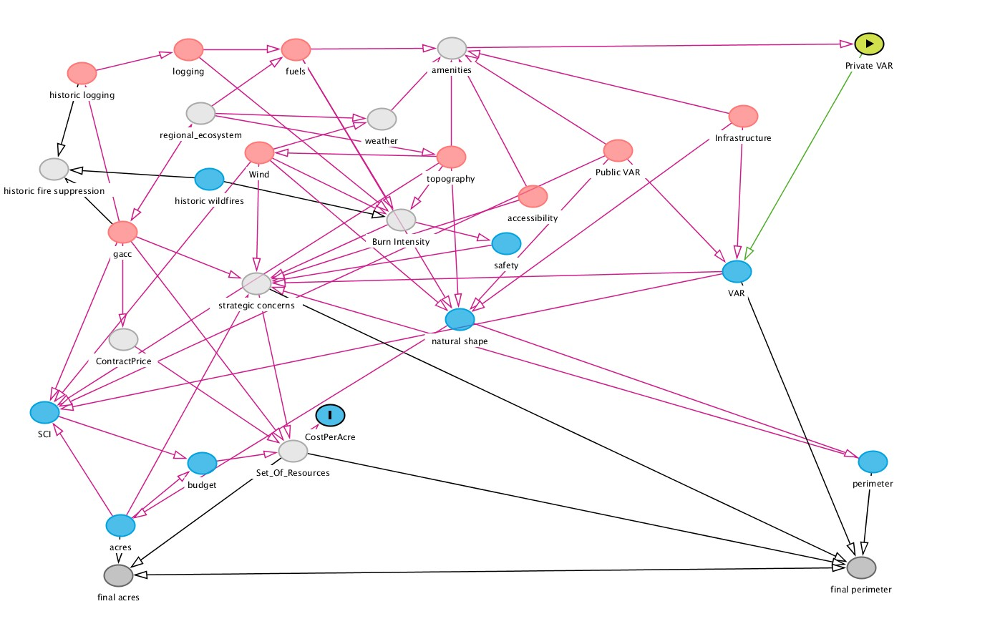
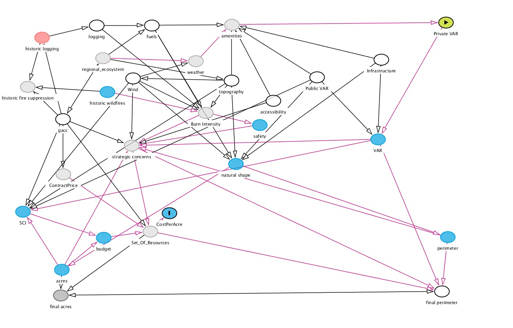

exclude: true
#class: inverse, middle


```{r Setup, include = F}
#options(htmltools.dir.version = FALSE)
library(pacman)
p_load(leaflet, ggplot2, ggthemes, viridis, dplyr, magrittr, knitr, gapminder, av, gganimate, emo, ggdag, dagitty, data.table)
# Define pink color
#red_pink <- "#e64173"
#red_pink <- "#e64173"
turquoise <- "#20B2AA"
orange <- "#FFA500"
red <- "#fb6107"
blue <- "#f92772"
green <- "#8bb174"
grey_light <- "grey70"
grey_mid <- "grey50"
grey_dark <- "grey20"
purple <- "#6A5ACD"
slate <- "#314f4f"
# Notes directory
dir_slides <- "/Users/connor/Desktop/GithubProjects/Econometrics/EC421/Spring2021/LectureNotes/01-intro/"
# Knitr options
opts_chunk$set(
  comment = "#>",
  fig.align = "center",
  fig.height = 7,
  fig.width = 10.5,
  # dpi = 300,
  # cache = T,
  warning = F,
  message = F
)

opts_chunk$set(dev = "svg")
```

```{css, echo = F}
@media print {
  .has-continuation {
    display: block !important;
  }
}

.hide-count .remark-slide-number {
  display: none;
}
```


```{r, echo = F, fig.height = 2, fig.width = 3}
p_load(magrittr, patchwork, tidyverse, grid)

dfwui = data.frame(wui = c(30782682, 36946860, 43434112), years = c(1990,2000,2010))

dffs = data.frame(fs_cost = c(397952000,206120000,377466000,240436000,918335000,477126000,701183000,284148000, 416704000,515516000,1410802000,952696000,1674040000,1327138000,1007244000, 818954000, 1704477000, 1620145000,1585856000,920529000,809499000,1374525000, 807800000, 1753500000, 2211700000,1523300000,3034200000,2180600000, 2622400000,  2828500000, 3651700000), years = c(1990:2020), pfire = c(NA,NA,NA,NA,NA,NA,NA,NA,NA,NA,NA,NA,NA,NA,NA ,NA,NA,NA,NA,NA,NA,622700000 ,573500000, 494100000,498900000,574200000,590000000,606300000,638300000, 669500000, 639300000))

dfwui %<>% mutate(wui_nrm = (wui - mean(wui))/sd(wui), wuith = wui/100000)
dffs %<>% mutate(fs_cost_nrm = (fs_cost - mean(fs_cost))/sd(fs_cost), fsth = fs_cost/1000000, pfireth = pfire/1000000)

droughtdt = read_csv('/home/connor/Downloads/drought-regional.csv')

drought = droughtdt %>% mutate(year = year(ValidEnd)) %>% group_by(year) %>% summarize(max_drought = max(D4)/max(D0 + D1 + D2 + D3 + D4)) %>% arrange(year)

pd = ggplot(drought, aes(x = year, y = max_drought))+ geom_smooth(aes(color = 'Maximum Pct of Land in Drought'), se = FALSE) + theme_minimal()+ scale_y_continuous(name =  '', labels = scales::percent) + labs(x = '') + scale_color_manual(name = '', label ='Maximum Annual %', values = "#db9200") + geom_hline(color = 'black', yintercept = 0)+ labs('Drought in Western US (% of land)') +theme(title = element_text('Drought in Western US (% of land)', colour = "#db9200", size = 8), legend.text = element_blank(), legend.position = "none") +ggtitle('Drought in Western US (% of land)')

pfs = ggplot(data = dffs, aes(x = years, y = fsth)) + geom_line(aes(colour = 'Total Fire Suppression'))  + geom_line(aes(y = pfireth, colour = 'Total Spending on All Fuel Treatment')) + theme_minimal()+ scale_y_continuous(name =  '', labels = scales::dollar_format()) + labs(x = '') + scale_color_manual(name = '', label ='Total Fire Suppression (millions)', values = c("#db9200",'#027802')) + geom_hline(color = 'black', yintercept = -1.5) + geom_vline(color = 'black', xintercept = 1990) + theme(legend.text = element_blank(), legend.position = "none")+ labs(title ="Total Fire Suppression (millions)", subtitle = "Total Expenditure on Fuel Treatments (millions)") +theme(plot.title =  element_text("Total Fire Suppression (millions)",color = "#db9200", size = 8),
    axis.title.y = element_text(color = "#db9200", size=8, vjust = 1, hjust = 8, angle = 0), plot.subtitle = element_text("Total Expenditure on Fuel Treatments (millions)",color = '#027802', size = 8)
    
  )
                                                                                                                                                        
pwui = ggplot(data = dfwui, aes(x = years, y = wuith)) + geom_line(aes(colour ='Homes in WUI (Normalized)')) + theme_minimal() +scale_y_continuous(name =  '', labels = scales::label_comma(), limits = c(300,450))+ labs(x = '')+ scale_color_manual(name = '', label ='Wui Homes (100,000s)', values = '#027802')+ geom_hline(color = 'black', yintercept = 300) + geom_vline(color = 'black', xintercept = 1990) + theme(legend.text = element_blank(), legend.position = "none")+ labs(title ="Homes in WUI (100,000s)") +theme(title = element_text("Homes in WUI (100,000s)",color = '#027802', size = 8),
    axis.title.y = element_text(color = '#027802', size=8, vjust = 1, hjust = 8, angle = 0),
    )                


p3 = ggplot(data = dffs, aes(x = years, y = fsth)) + geom_line(aes(colour = 'Total Fire Suppression')) + geom_line(data = dfwui, aes(y = wuith, colour ='Homes in WUI (Normalized)')) + theme_minimal()+ scale_y_continuous(name =  'Total Fire Suppression (millions) (2010)', labels = scales::dollar_format(), sec.axis = sec_axis(name ='Homes in WUI (100,000s)', trans=~.*(1/10), labels = scales::label_comma())) + labs(x = 'Year') + scale_color_manual(name = '', labels =c('Total Fire Suppression (millions)', 'WUI homes (100,000s)'), values = c('#027802', "#db9200")) + geom_hline(color = 'black', yintercept = -1.5) + geom_vline(color = 'black', xintercept = 1990) + theme(legend.text = element_blank(), legend.position = "none")+theme(
    axis.title.y = element_text(color = "#db9200", size=12, vjust = .2, hjust = 8, angle = 0),
    axis.title.y.right = element_text(color = '#027802', size=12, vjust = .2, hjust = -3, angle = 0)
  )

#pd
#p1
#axis.title.y.right = element_text(color = '#027802', size=12, vjust = 0, hjust = -3, angle = 0)
#sec.axis = sec_axis(name ='Homes in WUI (100,000s)', trans=~.*(1/10), labels = scales::label_comma())                                                                                                                                                                                                                                                                    #caption = "WUI: Wildland Urban Interface. \n Fire suppression data from NIFC \n Home-ownership data from Radeloff et al. (2019) supplemental content")

#pfs
#
```
---
class: inverse, middle

# Introduction

---
class: clear


.center[.smaller[*McCash fire, threatening California Seqouia: Inciweb, September 16, 2021*]]

.center[Unlike other natural disasters, damage from wildfire can be prevented by increasing .hi-orange[suppression effort]]

.footnote[.hi-orange[Suppression costs/effort:] *costs paid/effort exerted by government to prevent damage during a fire*]

--

.center[This allows for risk-abatement investment to be evaluated as an in-budget tradeoff.]

.center[Suppression costs over the last ten years: .hi-orange[$21.4 billion]] 

---

# Rising Costs: Missed Opportunities?


```{r, echo = F, fig.height = 6, fig.width = 7}
#grid.text("Total Expenditure on Fuel Treatment", x = unit(0.95, "npc"), y = unit(0.96, "npc"))
pfs/(pd+pwui)
```

]


---
# Research Goal

**Problem:** How can we estimate the wildfire suppression cost function?

--

 Currently: FS uses the .hi-orange[Stratified Cost Index (SCI)] which predicts historically-normed per-acre suppression cost elasticities.
 
 - Uses ignition point DEM, fuel model, and total property value within 20km in log-log OLS framework.
 
 
--

**1.** Is property .hi[value] a meaningful causal factor in fire suppression effort/costs?

**2.** If not, what are the consequences of using this variable in the cost function on estimated cost? 

 - does using it to produce historic benchmarks for fire managers bias their resource assignments towards wealthier/denser areas?

---
# Stratified Cost Index, Background
<br>
Historically, wildfire suppression costs went *unmonitored.*

--

The .hi-orange[Stratified Cost Index], or .hi-orange[SCI] developed in 2007 by a group of economists under the Bush admin to correct this gap. Big econometric (and accounting project.)

**SCI** addresses need: time-invariant (ignoring inflation) cost predictions of wildfire.

--

 - **Idea**: Rather than perform cost-benefit analysis, the **SCI** provides historic context for fire suppression costs, given local features (fuels, elevation and .hi[property values]) relevant to fire spread and costs.

**SCI Approach:** train an OLS model using features derived from the *point of ignition* and *relevant to fire spread/local assets at risk* on historic fire suppression costs $\rightarrow$ predict new wildfire expenditures.

--

 - .hi-black[Problem]: This procedure assumes spatial invariance, but are property values spatially invariant?

---
# Solution

.center[Use .hi-black[D]ouble/.hi-black[D]ebiased .hi-black[M]achine .hi-black[L]earning (.hi-black[D/DML]) to learn a **non-spatially-invariant** kernel that weights high-dimensional pre-fire environmental variables into best-predictor of fire costs]

.center[.hi-black[Entire field of ML] has techniques adaptable to this problem: Computer Vision]

--

.pull-left[
- .smaller[Use .hi-black[C]ompact .hi-black[C]onvolutional .hi-black[T]ransformer (.hi-black[CCT]), to reduce dimensions of the spatial problem, treating predictions of fire cost as confounders in a regression model (using rasters as channel inputs e.g., Slope, Fuels, Canopy Cover, Accessibility ...)]

]


.pull-right[

**Example:** CZU Complex (2020) Raster


]

.smaller[**Goal**: Produce causal estimates of property value on fire suppression costs, controlling for machine-learned fire risk attributes]

---
# Research

<br>

.center[**Headline Results**]

__1.__  Spatially Corrected Estimates? **Result:** - **Much** less important than previously estimated. .01% vs. .11% (.16% on data available) increase in suppression costs per percentage point increase in nearby property values (log-log estimate.)

--

__2.__ Improve the SCI? **Result:** Not just the SCI. Beats even regression models with full perimeter information. Improves $R^2$ from 60% (In sample) (35-60%) $\rightarrow$ 85% out of sample, and extends to fires previously considered 'too small' for cost forecasts.

--

__3.__ Legacy of SCI? **Result:** Using a D/DML RDD, around a 'mandatory cost estimation' threshold (300 acres)- exists evidence that cost-monitoring increases sensitivity of fire managers to property values


---
# Data

.center[1750 wildfires, 2020-2021 summer]

.center[Eventual OOD test - 3150 wildfires, 2020-2022]

.center[]

---
# Data

.center[1750 wildfires, 2020-2021 summer]

.center[Eventual OOD test - 3150 wildfires, 2020-2022]

.center[]
---
# Fitting

Model predictably underestimates highs and overestimates lows

.center[]
---
# Crossfitting

However, in general the errors in each model are small when the companion prediction errors are large

.center[]

---
class: clear

.center[]

---
# SCI and Income More Correlated?

<br>

We can use correlation between reported $SCI$ final costs and the $SCI_{nn}$ final costs to see if conditioning predictions directly on property value leads to predicted costs that are more correlated with income.

$$H_0: corr_1(SCI, Income_{20km}) <= corr_2(SCI_{nn}, Income_{20km})$$

--

$$p(H_0|corr_1 = .10, corr_2 = .03, n = 424) \approx 0.029$$
--

Tests on correlation between **property value, per-capita income and summed income** also reject in equivalent tests.

--

.hi[Hard to interpret:] know that the CCT forecast pearson coefficient is smaller, but no guarantee of better outcomes.

---
# Do Fire Managers Respond to Costs?

.center[]


---

# Conclusion
<br><br><br>

 - Once adjusting for non-invariant environmental factors, .hi[property values] appear to have an extremely small (insignificant) effect on suppression costs
 
--

 - Some evidence that .hi-orange[fire managers] respond to this modeling choice, and has some impact on behavior.

--

- Model proposed here is significantly less correlated with per-capita income, summed income and total property value near the point of ignition.

---
# Thank you!

---
# Sources

.smallest[Suppression costs, https://www.nifc.gov/fire-information/statistics/suppression-costs, 2020.

Abatzoglou, J. T., J. K. Balch, B. A. Bradley, and C. A. Kolden, Human-related ignitions concurrent with
high winds promote large wildfires across the USA, International Journal of Wildland Fire, 27(6), 377,
doi:10.1071/wf17149, 2018.

Abt, K. L., J. P. Prestemon, and K. M. Gebert, Wildfire Suppression Cost Forecasts for the US Forest Service,
Journal of Forestry, 107(4), 173–178, doi:10.1093/jof/107.4.173, 2009.

Albini, F. A., Spot fire distance from burning trees-a predictive model, Intermountain Forest; Range Experiment
Station, Forest Service, U.S. Dept. of Agriculture, 1979.

Alexander, M. E., and M. G. Cruz, Limitations on the accuracy of model predictions of wildland fire behaviour:
A state-of-the-knowledge overview, The Forestry Chronicle, 89(03), 372–383, doi:10.5558/tfc2013-067,
2013.

Bayham, J., and J. K. Yoder, Resource allocation under fire, Land Economics, 96(1), 92–110, doi:10.3368/le.
96.1.92, 2020.

Baylis, P., and J. Boomhower, Moral hazard, wildfires, and the economic incidence of natural disasters, Tech.
rep., doi:10.3386/w26550, 2019.


]
---
# Sources

.smallest[

Boychuk, D., W. J. Braun, R. J. Kulperger, Z. L. Krougly, and D. A. Stanford, A stochastic forest fire growth
model, Environmental and Ecological Statistics, 16(2), 133–151, doi:10.1007/s10651-007-0079-z, 2008.

Bronstein, M. M., J. Bruna, T. Cohen, and P. VeliÄkoviÄ, Geometric deep learning: Grids, groups, graphs,
geodesics, and gauges, 2021.

Buma, B., S. Weiss, K. Hayes, and M. Lucash, Wildland fire reburning trends across the US west suggest only
short-term negative feedback and differing climatic effects, Environmental Research Letters, 15(3), 034,026,
doi:10.1088/1748-9326/ab6c70, 2020.

Busenberg, G., Wildfire management in the united states: The evolution of a policy failure, Review of Policy
Research, 21(2), 145–156, doi:10.1111/j.1541-1338.2004.00066.x, 2004.

Butry, D. T., M. Gumpertz, and M. G. Genton, The production of large and small wildfires, pp. 79–106,
Springer Netherlands, doi:10.1007/978-1-4020-4370-3_5, 2008.

Calkin, D. E., T. Venn, M. Wibbenmeyer, and M. P. Thompson, Estimating US federal wildland fire managers’
preferences toward competing strategic suppression objectives, International Journal of Wildland Fire, 22(2),
212, doi:10.1071/wf11075, 2013.
]
---
# Sources

.smallest[
Chen, X., and H. White, Improved rates and asymptotic normality for nonparametric neural network estima-
tors, IEEE Transactions on Information Theory, 45(2), 682–691, doi:10.1109/18.749011, 1999.

Donovan, G. H., P. Noordijk, and V. Radeloff, Estimating the impact of proximity of houses on wildfire
suppression costs in oregon and washington, in In: 2004. Proceedings of 2nd Symposium on Fire Economics,
Planning and Policy: A Global View, 2004.

Dosovitskiy, A., et al., An image is worth 16x16 words: Transformers for image recognition at scale, 2021.
Farrell, M. H., T. Liang, and S. Misra, Deep neural networks for estimation and inference, Econometrica, 89(1),
181–213, doi:10.3982/ecta16901, 2021.

Finney, M. A., Fire growth using minimum travel time methods, Canadian Journal of Forest Research, 32(8),
1420–1424, doi:10.1139/x02-068, 2002.

Finney, M. A., An overview of flammap fire modeling capabilities, in In: Andrews, Patricia L.; Butler, Bret
W., comps. 2006. Fuels Management-How to Measure Success: Conference Proceedings. 28-30 March 2006;
Portland, OR. Proceedings RMRS-P-41. Fort Collins, CO: US Department of Agriculture, Forest Service, Rocky
Mountain Research Station. p. 213-220, vol. 41, 2006.

]
---
# Sources
.smallest[
Florec, V., M. P. Thompson, and F. R. y Silva, Cost of suppression, pp. 1–11, Springer International Publishing,
doi:10.1007/978-3-319-51727-8_96-1, 2019.

Gebert, K. M., and A. E. Black, Effect of suppression strategies on federal wildland fire expenditures, 110(2),
65–73, doi:10.5849/jof.10-068, 2012.

Gebert, K. M., D. E. Calkin, and J. Yoder, Estimating suppression expenditures for individual large wildland
fires, Western Journal of Applied Forestry, 22(3), 188–196, doi:10.1093/wjaf/22.3.188, 2007.

Gorte, R., and H. Economics, The rising cost of wildfire protection, Headwaters Economics Bozeman, MT, 2013.
Griliches, Z., Hedonic price indexes for automobiles: An econometric of quality change, in The Price Statistics
of the Federal Goverment, pp. 173–196, National Bureau of Economic Research, Inc, 1961.

Gude, P. H., K. Jones, R. Rasker, and M. C. Greenwood, Evidence for the effect of homes on wildfire
suppression costs, International Journal of Wildland Fire, 22(4), 537, doi:10.1071/wf11095, 2013.


]
---
# Sources

.smallest[

Hand, M. S., K. M. Gebert, J. Liang, D. E. Calkin, M. P. Thompson, and M. Zhou, Economics of wildfire man-
agement: the development and application of suppression expenditure models, Springer Science & Business
Media, 2014a.

Hand, M. S., K. M. Gebert, J. Liang, D. E. Calkin, M. P. Thompson, and M. Zhou, Regional and temporal
trends in wildfire suppression expenditures, in Economics of Wildfire Management, pp. 19–35, Springer,
2014b.

Hand, M. S., M. P. Thompson, and D. E. Calkin, Examining heterogeneity and wildfire management
expenditures using spatially and temporally descriptive data, Journal of Forest Economics, 22, 80–102,
doi:10.1016/j.jfe.2016.01.001, 2016.

Pearl, J., 3. the foundations of causal inference, Sociological Methodology, 40(1), 75–149, doi:10.1111/j.
1467-9531.2010.01228.x, 2010.

Preisler, H. K., A. L. Westerling, K. M. Gebert, F. Munoz-Arriola, and T. P. Holmes, Spatially explicit forecasts
of large wildland fire probability and suppression costs for california, International Journal of Wildland Fire,
20(4), 508, doi:10.1071/wf09087, 2011
]

---
# Sources

.smallest[
Wibbenmeyer, M., and M. Robertson, The distributional incidence of wildfire hazard in the western united
states, WP, 2021.

Yoder, J., and K. Gebert, An econometric model for ex ante prediction of wildfire suppression costs, Journal
of Forest Economics, 18(1), 76–89, doi:10.1016/j.jfe.2011.10.003, 2012.

]

---
class: inverse, middle

# Appendix

---
# Do Fire Managers Respond to Costs?

.center[]


---
# D/DML

At its core, D/DML is just another Doubly Robust Estimation identification strategy.

--

.center[**Doubly Robust Estimation**]

.pull-left[]

.pull-right[<br>

**Assumptions:**

**1.** No unobserved confounding.

**2.** Positivity: for continuous treatment, the conditional treatment density must be non-negative everywhere.

**3.** No Bad Controls

Source: [Python Causality Handbook](https://matheusfacure.github.io/python-causality-handbook/12-Doubly-Robust-Estimation.html)

]

---
# D/DML

<br><br><br><br>

**Takeaway:** This method requires the same three 'intuitive' assumptions required from your stock-standard conditional outcome/propensity score model.

**Idea:** Use existing causal information to encode dependencies, verified empirically by field experts/academic work.

---
# D/DML

**Lots** of existing information on individual preferences for environmental amenities

**Grounded and validated** model of wildfire spread and damage, used by forest service.

Link these models to get a full SCM/DAG to identify a good control set. $\rightarrow$ sufficient to identify our causal effect of interest.


.pull-left[]

.pull-right[]


---
# My Data

To help control for spatial variation in risk, fuels, amenities - you name it, I pair 1750 wildfires taking place over the 2020 and 2021 wildfire seasons with two separate datasets.

--

.pull-left[
.center[**1**]


]

.pull-right[
.center[**2**]
.center[CSV-style data on Management]
]
---
# Raster inputs

**Inputs to Fire Spread/Spotting Models:**

Canopy Bulk Density, Canopy Height, Canopy Base Height, Fuel Vegetation Height, Existing Vegetation Cover, Fuel Vegetation Cover, Vegetation Departure Index, 40 Class Fuel Model Distribution, Pre-response VIIRS detections, D.E.M. and derived attributes.

**Inputs to Strategic Resource ID learning:**

NLCD Imperviousness metric (LANDSAT measure of on-the-ground development), Protected Areas Database Membership, Private vs. Public Landownership, Communication/Cellphone Tower Locations, Average Travel/Evac Time (cell-level), Rasterized population grid

**Inputs to Weather and Information Set:**

Unconditional Burn Probability, Conditional Flame Length, Wind Speed (at time of ign.), Wind Direction, Total Precipitation over last 2 weeks, Estimated Soil Moisture, Drought Index.

---
# Tabular Inputs

<br><br>

## Tabular Inputs are much Simpler

Management Region (GACC), Reported Fuel Model, Hours between ignition and first response, total resources deployed Nationwide at time of initial response


---
# D/DML Meta-Models

Using out-of-sample estimates from two customized **Neural Network** models performing nonlinear regressions of Property Values and Suppression Costs 


$$P(X_i) = f(\cdot): \text{Treatment Propensity/Treatment Intensity}$$

$$\mu(X_i) = g(\cdot): \text{Conditional Outcome}$$


Where $X_i$ is a set of tabular and raster controls.

Estimate the following system of equations following Frisch Waugh Lovell (ish).

For wildfire suppression effort $i$...

$$log(Suppression\ Costs_i) = \theta log(Property\ Values_i) + g(X_i) + u_i\ \ \ (1)$$

$$log(Property\ Values_i) = f(X_i) + v_i\ \ \ (2)$$

<!--$$\small \theta \equiv param\ of\ interest, \ X \equiv \{Rsk, Envr, Amn, Ex.Supp\}, \eta \equiv\{f(X_i),g(X_i)\}$$-->

Estimating $\theta$ with linear estimators in this system of equations produces estimation error in $f$ in equation (2) that may produce bias


---
# D/DML

<br>

__Q__ How is this different from controlling for regression inputs?

--

__A__ Buys independence from all functions of inputs that are estimatible by the machine learning model.

**Regardless** of how fire managers respond to changes in fire risk/attributes, the model ought to capture that behavior so long as it is observed in the dataset and driven by causal logic.

Remember - there is no certifiable evidence that our fire managers are behaving optimally. Only assumption - they face the same inputs/outputs as an 'optimal' fire manager

---
# D/DML

<br>

__Q__ How is this different from controlling for regression inputs?

__A__ Buys independence from all functions of inputs that are estimatible by the machine learning model.

**Important:** This is more than linear OLS specifications, but it's substantially less than everything.

Implicit assumption - The estimation problem given to the ML model can converge to conditional outcome. 

Bias/Variance Tradeoff here is much different calculus than in a traditional prediction problem:

Takeaway - must ensure model is unbiased, at cost of higher variance. More than just *best predictor.*

# Meta-learner

.center[]

---
# Problems

Economists are always interested in 'who benefits' from the provision of any public good, but the .hi-orange[SCI] wasn't meant to do that.

- One takeaway from SCI: fire suppression costs are **caused** in part by total nearby property value.

 - Some researchers interpret .hi-orange[SCI] coefficients on 'sum of property values close to ignition' as **empirical** evidence of optimal suppression effort..super[.orange[*]]
 
 .footnote[.hi[*]: Donovan et al, 2004, Abt 2009, Gude 2013, Hand 2014...]
 
--

Fortunately, wildfire suppression costs are likely valid under .hi[exchangability] and .hi-orange[counterfactual consistency] with a sufficient set of controls.

--

.hi-orange[SCI] controls for environmental and topological factors at point of ignition, so this is reasonable if no included variables' dgp is impacted by location. 
--
.hi[Property value] likely violates this assumption.


---
# Implicit Assumption of SCI: Invariance

.hi-orange[Ignition point] predictions of wildfire costs $\implies$ assuming .hi[invariance].

Simplified example- imagine a featureless landscape with 1 neighborhood.

--

```{r, echo = F}
p_load(magrittr, scico)

df = data.frame(x = c(0:5), y = c(0:5))
                
paths = data.frame(p1x = c(2.5,2.5,3,3), p1y = c(2.5,3,4,5), p2x = c(2.5,1,0,0), p2y = c(2.5,2.5,1,1), p3x = c(2.5,3.5,4.5,4.5), p3y = c(2.5,1,0,0))

p1 = ggplot(data = df, aes(x = x, y = y)) + geom_rect(xmin = 2.25, xmax = 2.75, ymin = 2.25, ymax = 2.75, fill = orange, alpha = .3) + geom_rect(xmin = 1.00, xmax = 1.9, ymin = 1, ymax = 2.1, fill = green, alpha = .3) +  geom_label(x = 1.45, y = 1.55, label = 'W.U.I.', color = green) +  geom_rect(xmin = 0, xmax = 5, ymin = 0, ymax = 5, fill = 'dark grey', color = 'grey', alpha = .01) + geom_path(data = paths, aes(x = p1x, y = p1y, color = 'Suppression = $10,000')) + geom_path(data = paths, aes(x = p2x, y = p2y, color = 'Suppression = $1,000,000')) + geom_path(data = paths, aes(x = p3x, y = p3y, color = 'Suppression = $100,000')) + theme_minimal()+ scale_y_discrete(labels = NULL) + scale_x_discrete(labels = NULL) + labs(title = 'Potential Fire Paths', subtitle = 'Effect on suppression expenditure', y = "", x = '') + scale_color_scico_d(name = '', labels = c('Fire path 1: Suppression = $1,000,000','Fire path 2: Suppression = $10,000' , 'Fire path 3: Suppression = $100,000'), palette = "roma") + theme(legend.text=element_text(size=15), plot.caption = element_text(size = 15), plot.title= element_text(size = 15), plot.subtitle = element_text(size = 12))

p2 = ggplot(data = df, aes(x = x, y = y)) + geom_rect(xmin = 2.25, xmax = 2.75, ymin = 2.25, ymax = 2.75, fill = orange, alpha = .3) + geom_rect(xmin = 1.90, xmax = 2.8, ymin = 1, ymax = 2.1, fill = green, alpha = .3) +  geom_label(x = 2.3, y = 1.55, label = 'W.U.I.', color = green) +  geom_rect(xmin = 0, xmax = 5, ymin = 0, ymax = 5, fill = 'dark grey', color = 'grey', alpha = .01) + geom_path(data = paths, aes(x = p1x, y = p1y, color = 'Suppression = $10,000')) + geom_path(data = paths, aes(x = p2x, y = p2y, color = 'Suppression = $1,000,000')) + geom_path(data = paths, aes(x = p3x, y = p3y, color = 'Suppression = $100,000')) + theme_minimal()+ scale_y_discrete(labels = NULL) + scale_x_discrete(labels = NULL) + labs(title = 'Potential Fire Paths', subtitle = 'Effect on suppression expenditure', y = "", x = '') + scale_color_scico_d(name = '', labels = c('Fire path 1: Suppression = $1,000,000','Fire path 2: Suppression = $10,000' , 'Fire path 3: Suppression = $100,000'), palette = "roma") + theme(legend.text=element_text(size=15), plot.caption = element_text(size = 15), plot.title= element_text(size = 15), plot.subtitle = element_text(size = 12))

p3 = ggplot(data = df, aes(x = x, y = y)) + geom_rect(xmin = 2.25, xmax = 2.75, ymin = 2.25, ymax = 2.75, fill = orange, alpha = .3) + geom_rect(xmin = 1.50, xmax = 2.4, ymin = 3.2, ymax = 4.3, fill = green, alpha = .3) +  geom_label(x = 1.9, y = 3.75, label = 'W.U.I.', color = green) +  geom_rect(xmin = 0, xmax = 5, ymin = 0, ymax = 5, fill = 'dark grey', color = 'grey', alpha = .01) + geom_path(data = paths, aes(x = p1x, y = p1y, color = 'Suppression = $10,000')) + geom_path(data = paths, aes(x = p2x, y = p2y, color = 'Suppression = $1,000,000')) + geom_path(data = paths, aes(x = p3x, y = p3y, color = 'Suppression = $100,000')) + theme_minimal()+ scale_y_discrete(labels = NULL) + scale_x_discrete(labels = NULL) + labs(title = 'Potential Fire Paths', subtitle = 'Effect on suppression expenditure', y = "", x = '', caption = "Orange square is ignition location \n Green rct. represents WUI neighborhood \n lines represent potential fire paths") + scale_color_scico_d(name = '', labels = c('Fire path 1: Suppression = $1,000,000','Fire path 2: Suppression = $10,000' , 'Fire path 3: Suppression = $100,000'), palette = "roma") + theme(legend.text=element_text(size=15), plot.caption = element_text(size = 15), plot.title= element_text(size = 15), plot.subtitle = element_text(size = 12))

p4 = ggplot(data = df, aes(x = x, y = y)) + geom_rect(xmin = 2.25, xmax = 2.75, ymin = 2.25, ymax = 2.75, fill = orange, alpha = .3) + geom_rect(xmin = 3.5, xmax = 4.4, ymin = 2.5, ymax = 3.6, fill = green, alpha = .3) +  geom_label(x = 3.95, y = 3.05, label = 'W.U.I.', color = green) +  geom_rect(xmin = 0, xmax = 5, ymin = 0, ymax = 5, fill = 'dark grey', color = 'grey', alpha = .01) + geom_path(data = paths, aes(x = p1x, y = p1y, color = 'Suppression = $10,000')) + geom_path(data = paths, aes(x = p2x, y = p2y, color = 'Suppression = $1,000,000')) + geom_path(data = paths, aes(x = p3x, y = p3y, color = 'Suppression = $100,000')) + theme_minimal()+ scale_y_discrete(labels = NULL) + scale_x_discrete(labels = NULL) + labs(title = 'Potential Fire Paths', subtitle = 'Effect on suppression expenditure', y = "", x = '', caption = "Orange square is ignition location \n Green rct. represents WUI neighborhood \n lines represent potential fire paths") + scale_color_scico_d(name = '', labels = c('Fire path 1: Suppression = $1,000,000','Fire path 2: Suppression = $10,000' , 'Fire path 3: Suppression = $100,000'), palette = "roma") + theme(legend.text=element_text(size=15), plot.caption = element_text(size = 15), plot.title= element_text(size = 15), plot.subtitle = element_text(size = 12))
#values=c('#24E0A3','#E04524', 'grey'))

p1 + p2 + p3 + p4 +  plot_layout(ncol = 2, widths = c(2, 2), heights = c(2, 2),guides = 'collect')
```

---
# Bias

<br><br><br>

This assumption forces any variables with .hi[non-invariant] data generating processes to absorb any spatial variation

 - .hi-orange[SCI point variables:] Fuels, Weather, Elevation, Dryness/Cure, .hi[Property Value (20km)]

**Where should coefficient bias appear?**

---
# Econometric Models

**1.** Is Property Value a Causal Factor in Suppression Costs?

Follows a Doubly-Robust Identification Strategy

--

$$X_i \equiv \{Fuels_i, Weather_i, DEM_i,Fire\ Model\ Simulation_i, PAD_i\ ;\iota^{ign.}_i\}^{30m\ res.}_{32\ bands \times 30k \times 30k}$$


$$P(X_i) = f(\cdot): \text{Treatment Intensity}$$

$$\mu(X_i) = g(\cdot): \text{Conditional Outcome}$$

$$log(\frac{Suppression\ Costs_i}{Acres_i}) = \theta log(Property\ Values_i) + g(X_i) + u_i\ \ \ (1)$$

$$log(Property\ Values_i) = f(X_i) + v_i\ \ \ (2)$$
--

$$\hat{\theta} \equiv \text{Estimand of Interest; } \frac{\%\Delta \text{Suppression Costs}}{\%\Delta \text{Property Values}}$$

---
# Econometric Models

**2.** Sensitivity change?

Follows a Doubly-Robust Identification Strategy, combined with RDD, rv: Wildfire Acres

- restrict wildfires to fires that had only one-two day-batches of resource assignment

- exclude control group always-takers.

--

**Data**:

$$X_i \equiv \{Fuels_i, Weather_i, DEM_i,Fire\ Model\ Simulation_i, PAD_i\ ;\iota^{ign.}_i\}^{30m\ res.}_{32\ bands \times 30k \times 30k}$$


$$\mu = 1: \text{Monitoring required, ie, Size > 300}$$
---
# Econometric Models

**2.** Sensitivity change?

$$log(\frac{Suppression\ Costs_i}{Acres_i}) = \beta_1\mu+ \theta log(Property\ Values_i) + g_{\mu}(X_i|\mu) + u_i\ \ \ (1)$$

$$log(Property\ Values_i) = f_{\mu}(X_i|\mu) + v_i\ \ \ (2)$$

<br>

**Data**:

$$X_i \equiv \{Fuels_i, Weather_i, DEM_i,Fire\ Model\ Simulation_i, PAD_i\ ;\iota^{ign.}_i\}^{30m\ res.}_{32\ bands \times 30k \times 30k}$$

$$\mu = 1: \text{Monitoring required, ie, Size > 300}$$

<br>

**Hypotheses**:
$$H_0: \beta_1 = 0, H_a: \beta_1 \neq 0$$

---
# DAG-work

.center[]

---
# DAG-work 2

.center[]

---
# Why 'Acres'/'Perimeter' is Bad Control

.center[]
---

---
# Cost Monitoring (General)

<br><br><br>

$$Total\ Cost = f(h(L,K),\tilde{P})$$
$$Total\ Benefit = g(h(L,K), Env)$$

Ideally, we want...

$$\frac{\partial f}{\partial h}\frac{\partial h}{\partial K} = \frac{\partial g}{\partial h}\frac{\partial h}{\partial K}$$
But in both cases, $h$ is not observed. So we settle for next-best estimate, technical efficiency in costs.
---
# Stratified Cost Index
<br>
Historically, wildfire suppression costs went *unmonitored.*

--

The .hi-orange[Stratified Cost Index], or .hi-orange[SCI] developed in 2007 by a group of economists under the Bush admin to correct this gap. Big econometric (and accounting project.)

**SCI** addresses need: time-invariant (ignoring inflation) cost predictions of wildfire.

--

 - **Idea** : Rather than perform cost-benefit analysis, the **SCI** provides historic context for fire suppression costs, given local features relevant to fire spread and costs.

**SCI Approach:** train an OLS model using features derived from the *point of ignition* and *relevant to fire spread/local assets at risk* on historic fire suppression costs $\rightarrow$ predict new wildfire expenditures.

--

Use **predictions** from SCI and their standard errors as guideline to audit new fires

---
# What does the kernel Look Like?

Pretty hard to figure out, with as many inputs as we have, what actually matters.

--

Harder still - these functions are not linear. How do we get interpretable 'coefficient equivalents'? How about partial gradients?

$$\hat{\beta}_{nonlin} \equiv \frac{\partial f}{\partial X_i}*X_i$$

Shown: good performance across interpretability metrics in lab settings.

However - if we have very 'flat' gradients...

$$\frac{\partial f}{\partial X_i} \approx 0$$ 

...we only have local information about the activation 

- could be flat because at peak of mountain (meaning it's really important to the function) or may be flat everywhere.

---
# Kernel, improved

<br><br><br><br>

Good news: Because Neural Networks are differentiable everywhere, I can use a very cool tool to explore what I'm controlling for in full.

Known as 'integrated gradients' essentially it calculates an approximate Riemann sum of gradients to get true conditional value, following the Gauss-Legendre formula.

---
# Visualizing the Kernel

<br><br>

$$IG := (x_i - x_i') \times \int^1_{\alpha = 0}\frac{\partial NN(x_i' + \alpha*(x_i - x_i'))}{\partial x_i}$$
Where $x_i$ is an image, but practically speaking could be as fine-grained as a single channel-pixel.

--

This buys me an 'explainability' map over the features I put into the CCT, and allows me to point you directly at what the meta-learner uses to adjust treatment propensity and outcome level.

---
# Kernel
.center[**Holiday Farm Fire:** NLCD Impermeability metric]

.center[]

---
# Kernel
.center[**Holiday Farm Fire:** NLCD Impermeability metric (point of ignition)]

.center[]

---
# Kernel
.center[**Holiday Farm Fire:** NLCD Impermeability metric]

.center[]

---
# Kernel
.center[**Holiday Farm Fire:** NLCD Impermeability metric]

.center[]

---
# Kernel
.center[**Holiday Farm Fire:** NLCD Impermeability metric]

.center[]

---
# Kernel: Utah
.center[**Range Fire:** NLCD Impermeability metric]


.center[]


---
# Kernel: Utah
.center[**Range Fire:** Slope DEM metric]


.center[]

```{R, print pdfs, echo = F, eval = T}
pagedown::chrome_print(input = "Slides-JMP-present2.html", output = 'SCI-slides-spring.pdf', wait = 20)
```

