exclude: true
#class: inverse, middle


```{r Setup, include = F}
#options(htmltools.dir.version = FALSE)
library(pacman)
p_load(leaflet, ggplot2, ggthemes, viridis, dplyr, magrittr, knitr, gapminder, av, gganimate, emo, ggdag, dagitty, data.table)
# Define pink color
#red_pink <- "#e64173"
#red_pink <- "#e64173"
turquoise <- "#20B2AA"
orange <- "#FFA500"
red <- "#fb6107"
blue <- "#f92772"
green <- "#8bb174"
grey_light <- "grey70"
grey_mid <- "grey50"
grey_dark <- "grey20"
purple <- "#6A5ACD"
slate <- "#314f4f"
# Notes directory
dir_slides <- "/Users/connor/Desktop/GithubProjects/Econometrics/EC421/Spring2021/LectureNotes/01-intro/"
# Knitr options
opts_chunk$set(
  comment = "#>",
  fig.align = "center",
  fig.height = 7,
  fig.width = 10.5,
  # dpi = 300,
  # cache = T,
  warning = F,
  message = F
)

opts_chunk$set(dev = "svg")
```

```{css, echo = F}
@media print {
  .has-continuation {
    display: block !important;
  }
}

.hide-count .remark-slide-number {
  display: none;
}
```


```{r, echo = F, fig.height = 2, fig.width = 3}
p_load(magrittr, patchwork, tidyverse)

dfwui = data.frame(wui = c(30782682, 36946860, 43434112), years = c(1990,2000,2010))

dffs = data.frame(fs_cost = c(397952000,206120000,377466000,240436000,918335000,477126000,701183000,284148000, 416704000,515516000,1410802000,952696000,1674040000,1327138000,1007244000, 818954000, 1704477000, 1620145000,1585856000,920529000,809499000,1374525000, 807800000, 1753500000, 2211700000,1523300000,3034200000,2180600000, 2622400000,  2828500000, 3651700000), years = c(1990:2020))

dfwui %<>% mutate(wui_nrm = (wui - mean(wui))/sd(wui), wuith = wui/100000)
dffs %<>% mutate(fs_cost_nrm = (fs_cost - mean(fs_cost))/sd(fs_cost), fsth = fs_cost/1000000)

droughtdt = read_csv('/home/connor/Downloads/drought-regional.csv')

drought = droughtdt %>% mutate(year = year(ValidEnd)) %>% group_by(year) %>% summarize(max_drought = max(D4)/max(D0 + D1 + D2 + D3 + D4)) %>% arrange(year)

pd = ggplot(drought, aes(x = year, y = max_drought))+ geom_smooth(aes(color = 'Maximum Pct of Land in Drought'), se = FALSE) + theme_minimal()+ scale_y_continuous(name =  '', labels = scales::percent) + labs(x = '') + scale_color_manual(name = '', label ='Maximum Annual %', values = "#db9200") + geom_hline(color = 'black', yintercept = 0)+ labs('Drought in Western US (% of land)') +theme(title = element_text('Drought in Western US (% of land)', colour = "#db9200", size = 8), legend.text = element_blank(), legend.position = "none") +ggtitle('Drought in Western US (% of land)')

pfs = ggplot(data = dffs, aes(x = years, y = fsth)) + geom_line(aes(colour = 'Total Fire Suppression'))  + theme_minimal()+ scale_y_continuous(name =  '', labels = scales::dollar_format()) + labs(x = '') + scale_color_manual(name = '', label ='Total Fire Suppression (millions)', values = "#db9200") + geom_hline(color = 'black', yintercept = -1.5) + geom_vline(color = 'black', xintercept = 1990) + theme(legend.text = element_blank(), legend.position = "none")+ labs(title ="Total Fire Suppression (millions)") +theme(title =  element_text("Total Fire Suppression (millions)",color = "#db9200", size = 8),
    axis.title.y = element_text(color = "#db9200", size=8, vjust = 1, hjust = 8, angle = 0),
    
  )
                                                                                                                                                        
pwui = ggplot(data = dfwui, aes(x = years, y = wuith)) + geom_line(aes(colour ='Homes in WUI (Normalized)')) + theme_minimal() +scale_y_continuous(name =  '', labels = scales::label_comma(), limits = c(300,450))+ labs(x = '')+ scale_color_manual(name = '', label ='Wui Homes (100,000s)', values = '#027802')+ geom_hline(color = 'black', yintercept = 300) + geom_vline(color = 'black', xintercept = 1990) + theme(legend.text = element_blank(), legend.position = "none")+ labs(title ="Homes in WUI (100,000s)") +theme(title = element_text("Homes in WUI (100,000s)",color = '#027802', size = 8),
    axis.title.y = element_text(color = '#027802', size=8, vjust = 1, hjust = 8, angle = 0),
    )                


p3 = ggplot(data = dffs, aes(x = years, y = fsth)) + geom_line(aes(colour = 'Total Fire Suppression')) + geom_line(data = dfwui, aes(y = wuith, colour ='Homes in WUI (Normalized)')) + theme_minimal()+ scale_y_continuous(name =  'Total Fire Suppression (millions) (2010)', labels = scales::dollar_format(), sec.axis = sec_axis(name ='Homes in WUI (100,000s)', trans=~.*(1/10), labels = scales::label_comma())) + labs(x = 'Year') + scale_color_manual(name = '', labels =c('Total Fire Suppression (millions)', 'WUI homes (100,000s)'), values = c('#027802', "#db9200")) + geom_hline(color = 'black', yintercept = -1.5) + geom_vline(color = 'black', xintercept = 1990) + theme(legend.text = element_blank(), legend.position = "none")+theme(
    axis.title.y = element_text(color = "#db9200", size=12, vjust = .2, hjust = 8, angle = 0),
    axis.title.y.right = element_text(color = '#027802', size=12, vjust = .2, hjust = -3, angle = 0)
  )

#pd
#p1
#axis.title.y.right = element_text(color = '#027802', size=12, vjust = 0, hjust = -3, angle = 0)
#sec.axis = sec_axis(name ='Homes in WUI (100,000s)', trans=~.*(1/10), labels = scales::label_comma())                                                                                                                                                                                                                                                                    #caption = "WUI: Wildland Urban Interface. \n Fire suppression data from NIFC \n Home-ownership data from Radeloff et al. (2019) supplemental content")

#pfs
#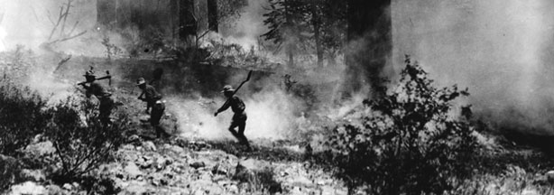
```
---
class: inverse, middle

# Introduction

---
class: clear


.center[.smaller[*McCash fire, threatening California Seqouia: Inciweb, September 16, 2021*]]

.center[Unlike other natural disasters, damage from wildfire can be prevented by increasing .hi-orange[suppression effort]]

.footnote[.hi-orange[Suppression costs/effort:] *costs paid/effort exerted by government to prevent damage during a fire*]

--

.center[This allows for risk-abatement investment to be evaluated as an in-budget tradeoff.]

.center[ .hi-black[interesting opportunity] for forest service - long-run budget balance.]

.center[Suppression costs over the last ten years: .hi-orange[$21.4 billion]] 

---

# Rising Costs: Missed Opportunities?


```{r, echo = F, fig.height = 6, fig.width = 7}

pfs/(pd+pwui)
```

]


---
# Research Goal

**Problem:** How can we estimate counterfactual wildfire costs?

 - Currently: 

<br>

**1.** Is property .hi[value] a meaningful causal factor in fire suppression effort/costs?

--

<br>

**2.** If not, does using it to produce historic benchmarks for fire managers bias their resource assignments towards wealthier/denser areas?

---

# Fire Economics

Where does fire suppression fit in our economic theory map?

--

.center[Wildfire suppression provision is a defense economy - .hi-orange[public good].]

--

Characteristics of a __defense economy__:

- fixed contract prices and labor in the short-medium term

- complex production function, usually environment dependent

- Abatement of potential future physical harm (or making said abatement more cost effective). **Near-impossible** to accurately estimate quantity (what's the counterfactual?)

- Defined by a difficult-to-monitor principal/agent problem. 

 - central government acts as 'principal', profit-maximizing agents, revenue maximizing bureaucracies (DOI, FS)

---
# Cost Monitoring

.center[Efficiency observed/interpreted at the intermediate good level 

*eg. single suppression effort*

Defense economies __rarely__ resemble efficient markets. Why?]

--

**1.)** Defense is not excludable - even on a larger scale.

--

**2.)** Employees and managers are difficult to monitor, leading to potentially inefficient levels of effort/assignments of resources.

--

**3.)** Generally occur under monopsony conditions. (GACCs, centralized hiring)

--

**4.)** Defense economies produce 'defense' via two intermediate goods - .hi[defensive (preventative)] and .hi[offensive (direct)]. 

Have different inputs and considered complementary.

---
# .hi-orange[Suppression] vs. Containment

<br><br>

.center[.hi-orange[Suppression:] Resources are used to .hi-black[slow down] the spread of fire or put out actively burning flames. *Offensive* action]

.pull-right[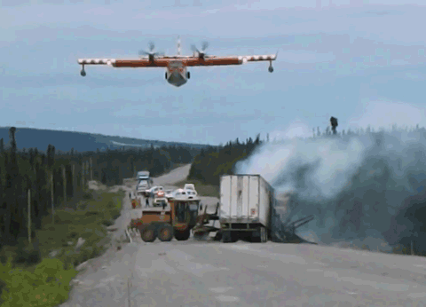]

.pull-left[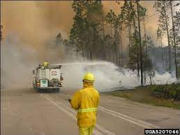]


---
# Suppression vs. .hi-orange[Containment]

<br><br>

.center[.hi-orange[Containment:] Resources are used to prevent future spread of fire and protect possible at-risk assets. *Defensive* action]

.pull-right[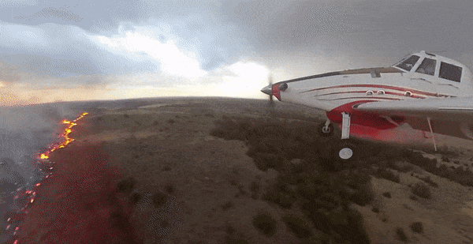]

.pull-left[]

---
# Optimal Suppression?

.pull-left[
<br>

.center[How does one measure 'optimal' defense provision if outputs aren't directly observed?]

.center[.hi-black[Usual Sol'n:] We turn to our friend the principal/agent model.]

.center[Introduce **cost-monitoring** to: 
prevent budget-hoarding by bureaucracies to 
ensure reasonably *technical* efficiency]

]

.pull-right[

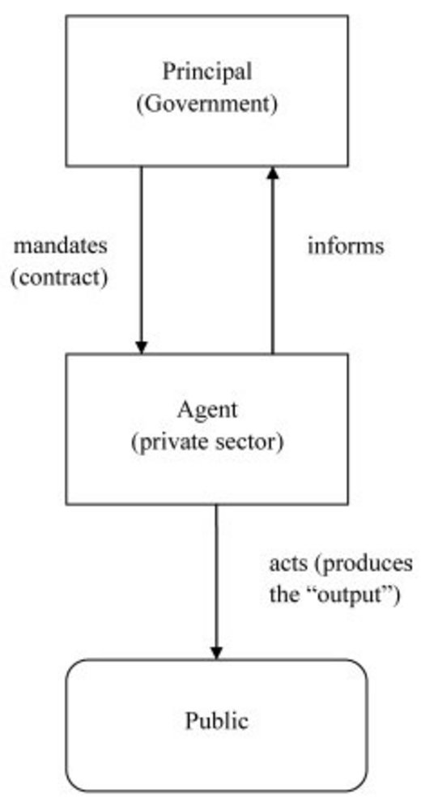.more-right[.orange[^]]
]
.footnote[.orange[^]De Palma, A., Leruth, L. & Prunier, G. (2012). Towards a Principal-Agent Based Typology of Risks in Public-Private Partnerships. Reflets et perspectives de la vie économique, LI, 57-73. https://doi.org/10.3917/rpve.512.0057]
---
# Cost Monitoring (General)

<br><br><br>

$$Total\ Cost = f(h(L,K),\tilde{P})$$
$$Total\ Benefit = g(h(L,K), Env)$$

Ideally, we want...

$$\frac{\partial f}{\partial h}\frac{\partial h}{\partial K} = \frac{\partial g}{\partial h}\frac{\partial h}{\partial K}$$
But in both cases, $h$ is not observed. So we settle for next-best estimate, technical efficiency in costs.
---
# Stratified Cost Index
<br>
Historically, wildfire suppression costs went *unmonitored.*

--

The .hi-orange[Stratified Cost Index], or .hi-orange[SCI] developed in 2007 by a group of economists under the Bush admin to correct this gap. Big econometric (and accounting project.)

**SCI** addresses need: time-invariant (ignoring inflation) cost predictions of wildfire.

--

 - **Idea** : Rather than perform cost-benefit analysis, the **SCI** provides historic context for fire suppression costs, given local features relevant to fire spread and costs.

**SCI Approach:** train an OLS model using features derived from the *point of ignition* and *relevant to fire spread/local assets at risk* on historic fire suppression costs $\rightarrow$ predict new wildfire expenditures.

--

Use **predictions** from SCI and their standard errors as guideline to audit new fires

---
# Problems

Economists are always interested in 'who benefits' from the provision of any public good, but the .hi-orange[SCI] wasn't meant to do that.

- One takeaway from SCI: fire suppression costs are **caused** in part by total nearby property value.

 - Some researchers interpret .hi-orange[SCI] coefficients on 'sum of property values close to ignition' as **empirical** evidence of optimal suppression effort..super[.orange[*]]
 
 .footnote[.hi[*]: Donovan et al, 2004, Abt 2009, Gude 2013... a lot]
 
--

.hi-orange[SCI] controls for environmental and topological factors at point of ignition, so this is reasonable under a no spatial confounding assumption.

--
 
**Problem:** Environmental factors *close to, but not at the point of ignition* dictate strategic provision of supplied intermediate fire suppression goods AND potentially correlate with property values.

Worse problem: most of these are 'latent' self-reported variables.

---
class: clear

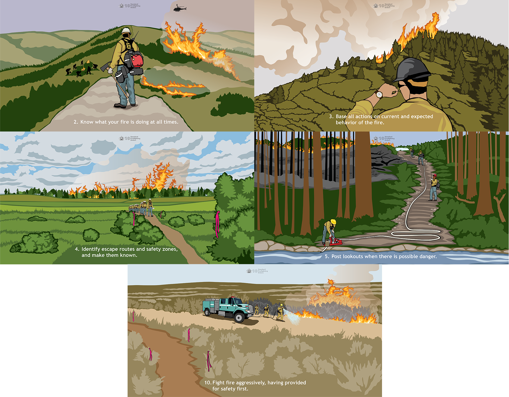

---
# Safety first

.pull-right[<br><br><br><br>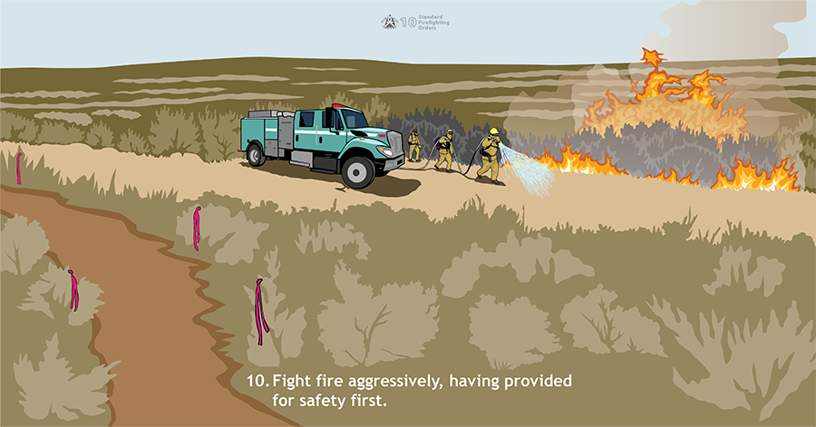]

.pull-left[.hi-black[Q:] Does 'safety' of a given action correlate to higher property values?

- area of viewshed $\uparrow$ safety

- nearby traversable water features/major throughways $\uparrow$ safety

- availability of cell towers $\uparrow$ safety

- accessibility $\uparrow$ safety

These factors change .hi-black[what] actions can be performed.

]

---
#Safety first
<br><br><br>

$$SCI\ Prediction = \beta_0 + X_{\text{ignition env. cond.}}\vec{\beta_1} + X_{\text{Management Priorities}}\vec{\beta_2}$$

.hi-black[Bias<sub>1<sub/>]: Safety (in $X_{\text{Management Priorities}}$) impacts suppression actions on the intensive margin, and is correlated to amenities (controlled for hyper-locally in $X_{\text{ignition env. cond.}}$)

.hi-black[Bias<sub>2<sub/>]: Non-ignition amenities themselves are strategic resources to protect, impacting suppression actions on the extensive margin.

.center[.hi[How do we control for these confounders?]]

---
#Control

.hi-black[Idea 1:] Use placement of firelines/fire resources throughout a fire to control for extensive margin effects...

--
&#10060;

- Placement of resources is a direct consequence of desired strategic outcomes (controlling for descendant of treatment)

.hi-black[Idea 2:] Use **average** of environmental variables within a fire perimeter to condition out bias from environmental variables...
--
&#10060;

- Perimeter and total acres are outcomes of fire suppression effort (and thus costs) so this would be conditioning the dataset on an outcome.

--

.hi[We need:] a time-invariant, yet event and outcome-agnostic way to model treatment, using strategically-important inputs, with varying total nearby property values, using only data available Ex Ante.

--

.hi-black[Problem:] Unconditional on event-specific factors, millions of features would be required to estimate treatment propensity/conditional outcomes.

---
# Solution

.center[Use .hi-black[D]ouble/.hi-black[D]ebiased .hi-black[M]achine .hi-black[L]earning (.hi-black[D/DML]) to learn a kernel that weights high-dimensional pre-fire environmental variables into best-predictor of fire costs]

.center[.hi-black[Entire field of ML] has techniques adaptable to this problem: Computer Vision]

--

.pull-left[
- .smaller[Use .hi-black[C]ompact .hi-black[C]onvolutional .hi-black[T]ransformer (.hi-black[CCT]), to reduce dimensions of the spatial problem, treating predictions of fire cost as confounders in a regression model (using rasters as channel inputs e.g., Slope, Fuels, Canopy Cover, Accessibility ...)]

]


.pull-right[

**Example:** CZU Complex (2020) Raster


]

.smaller[**Goal**: Produce causal estimates of property value on fire suppression costs, controlling for machine-learned fire risk attributes]

---
# Research Goals

.center[**4 Main Goals of Work:**]

__1.__ Test implicit hypothesis directly: does total property value lead to higher suppression expenditure?

 - How much of this association can be explained by correlation between spatially-varying environmental amenities and strategic considerations?

--

__2.__ Can the SCI be improved upon as a cost-context device?  

--

__3.__ Test predictions of defense economy principal/agent model in a real-world case

--

__4.__ What legacy has using property value in a cost-monitoring device had on fire suppression strategic behavior?

- Evidence of algorithmic bias?

---
# Research Goals

<br>

.center[**Headline Results**]

__1.__  Implicit Hypothesis? **Result:** - **Much** less important than previously estimated. .01% vs. .11% increase in suppression costs per percentage point increase in nearby property values

--

__2.__ Improve the SCI? **Result:** Not just the SCI. Beats even regression models with full perimeter information. Improves $R^2$ from 60% (35-60%) $\rightarrow$ 93%, and extends to fires previously considered 'too small' for cost forecasts.

--

__3.__ Principal/Agent model test? **Result:** mixed evidence of reduced suppression costs as result of monitoring.

--

__4.__ Legacy of SCI? **Result:** Some evidence that cost-monitoring increases sensitivity of fire managers to property values

---
class: inverse, middle

# Methods and Assumptions

---
# D/DML

<br>

**Let's get messy.** I am using Double/Debiased Machine Learning as my causal model.

- Unlike many other models, it is more of a procedure than a statistical framework.

--

Breaks problem of inference into smaller chunks that can be handled individually as prediction problems. These chunks are called 'meta-learners.'

- 'Meta' learners (typically) get handwaved away. It's important though to understand how those meta-learners work to be sure your methodology will function appropriately.

If the class of problems the meta-learner is designed to solve is ill-suited to the problem at hand, you can end up in a much worse environment than you began.

---
# D/DML

At its core, D/DML is just another Doubly Robust Estimation identification strategy.

--

.center[**Doubly Robust Estimation**]

.pull-left[]

.pull-right[<br>

**Assumptions:**

**1.** No unobserved confounding.

**2.** Positivity: for continuous treatment, the conditional treatment density must be non-negative everywhere.

**3.** No Bad Controls

Source: [Python Causality Handbook](https://matheusfacure.github.io/python-causality-handbook/12-Doubly-Robust-Estimation.html)

]

---
# D/DML

<br><br><br><br>

**Takeaway:** This method requires the same three 'intuitive' assumptions required from your stock-standard conditional outcome/propensity score model.

**Idea:** Use existing causal information to encode dependencies, verified empirically by field experts/academic work.

---
# D/DML

**Lots** of existing information on individual preferences for environmental amenities

**Grounded and validated** model of wildfire spread and damage, used by forest service.

Link these models to get a full SCM/DAG to identify a good control set. $\rightarrow$ sufficient to identify our causal effect of interest.


.pull-left[]

.pull-right[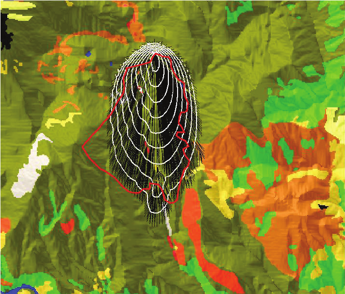]


---
# My Data

To help control for spatial variation in risk, fuels, amenities - you name it, I pair 1750 wildfires taking place over the 2020 and 2021 wildfire seasons with two separate datasets.

--

.pull-left[
.center[**1**]

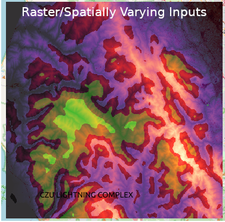
]

.pull-right[
.center[**2**]
.center[CSV-style data on Management]
]
---
# Raster inputs

**Inputs to Fire Spread/Spotting Models:**

Canopy Bulk Density, Canopy Height, Canopy Base Height, Fuel Vegetation Height, Existing Vegetation Cover, Fuel Vegetation Cover, Vegetation Departure Index, 40 Class Fuel Model Distribution, Pre-response VIIRS detections, D.E.M. and derived attributes.

**Inputs to Strategic Resource ID learning:**

NLCD Imperviousness metric (LANDSAT measure of on-the-ground development), Protected Areas Database Membership, Private vs. Public Landownership, Communication/Cellphone Tower Locations, Average Travel/Evac Time (cell-level), Rasterized population grid

**Inputs to Weather and Information Set:**

Unconditional Burn Probability, Conditional Flame Length, Wind Speed (at time of ign.), Wind Direction, Total Precipitation over last 2 weeks, Estimated Soil Moisture, Drought Index.

---
# Tabular Inputs

<br><br>

## Tabular Inputs are much Simpler

Management Region (GACC), Reported Fuel Model, Hours between ignition and first response, total resources deployed Nationwide at time of initial response


---
# D/DML Meta-Models

Using out-of-sample estimates from two customized **Neural Network** models performing nonlinear regressions of Property Values and Suppression Costs 


$$P(X_i) = f(\cdot): \text{Treatment Propensity/Treatment Intensity}$$

$$\mu(X_i) = g(\cdot): \text{Conditional Outcome}$$


Where $X_i$ is a set of tabular and raster controls.

Estimate the following system of equations following Frisch Waugh Lovell (ish).

For wildfire suppression effort $i$...

$$log(Suppression\ Costs_i) = \theta log(Property\ Values_i) + g(X_i) + u_i\ \ \ (1)$$

$$log(Property\ Values_i) = f(X_i) + v_i\ \ \ (2)$$

<!--$$\small \theta \equiv param\ of\ interest, \ X \equiv \{Rsk, Envr, Amn, Ex.Supp\}, \eta \equiv\{f(X_i),g(X_i)\}$$-->

Estimating $\theta$ with linear estimators in this system of equations produces estimation error in $f$ in equation (2) that may produce bias


---
# D/DML

<br>

__Q__ How is this different from controlling for regression inputs?

--

__A__ Buys independence from all functions of inputs that are estimatible by the machine learning model.

**Regardless** of how fire managers respond to changes in fire risk/attributes, the model ought to capture that behavior so long as it is observed in the dataset and driven by causal logic.

Remember - there is no certifiable evidence that our fire managers are behaving optimally. Only assumption - they face the same inputs/outputs as an 'optimal' fire manager

---
# D/DML

<br>

__Q__ How is this different from controlling for regression inputs?

__A__ Buys independence from all functions of inputs that are estimatible by the machine learning model.

**Important:** This is more than linear OLS specifications, but it's substantially less than everything.

Implicit assumption - The estimation problem given to the ML model can converge to conditional outcome. 

Bias/Variance Tradeoff here is much different calculus than in a traditional prediction problem:

Takeaway - must ensure model is unbiased, at cost of higher variance. More than just *best predictor.*

---
# D/DML: The Meta Learner

<br>


**Transformer:** developed for Natural Language Processing.

Treat words/tokens as numeric vectors.

Allows model to use weights and basic linear algebra, along with word content (numeric values in vector) to learn a data-driven sequence:

- dot product of two parallel vectors = large number, whereas dot product of perpendicular vectors = 0.

Vision transformer uses .hi-green[image patches] as elements in an unordered sequence/bag-of-patches approach.

---
# D/DML The Meta Learner

.center[**Modified CCT**]

.center[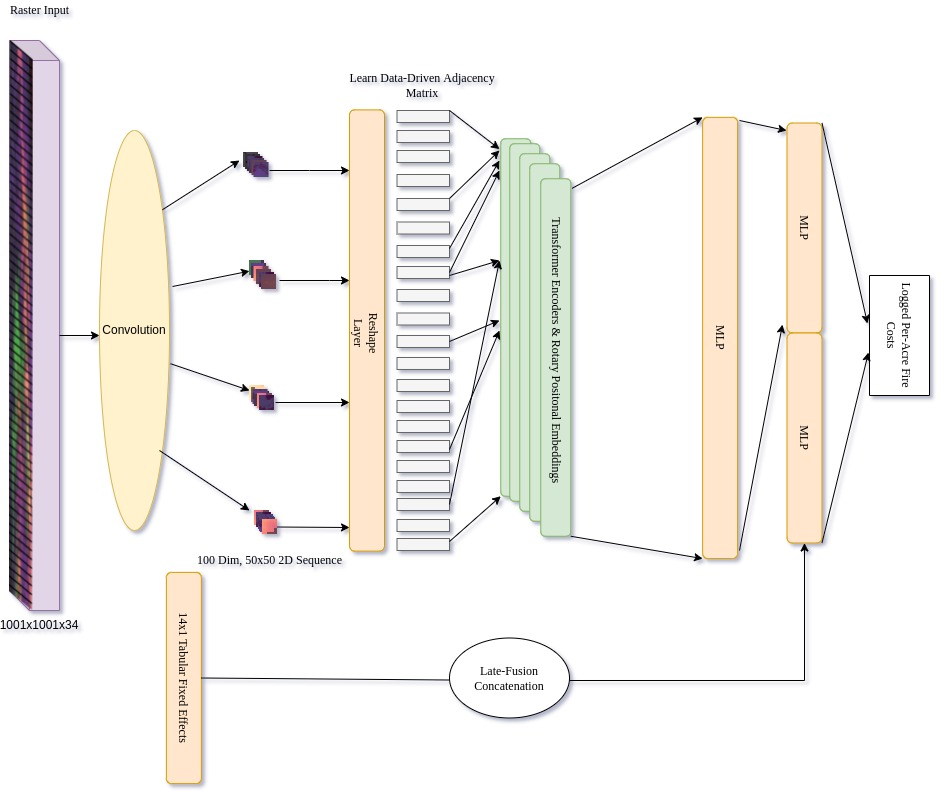]

---
# D/DML

<br><br>

The OLS-equivalent problem is .hi-green[ill-posed.] Requires considerable feature engineering and assumptions about fire manager behavior.

.center[**34,068,048** inputs per fire.]

Because this takes place outside of optimal market conditions, not appropriate to place optimality assumptions on feature engineering.

**Instead** use model sufficiently flexible to model fire spread and hedonic value of property, allow the data to find this relationship.

.hi-orange[Downside:] I won't be able to say much about the utility function fire managers use to best-respond.

---
class: inverse, middle

# Results

---
# Results 1 (Data)

**Data**: 1750 wildfires occurring between January 2020 and July 2021 with reported costs from the reconstructed IRWIN database (ICS 209 forms, but digital.)

.center[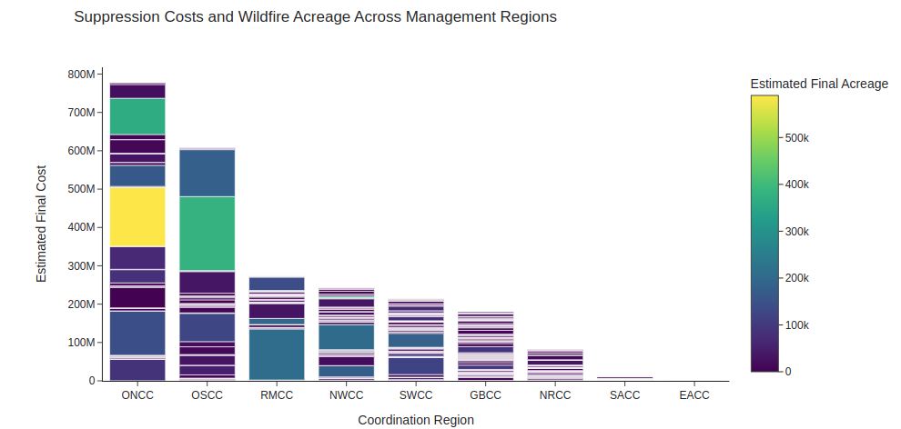]

.pull-right[.center[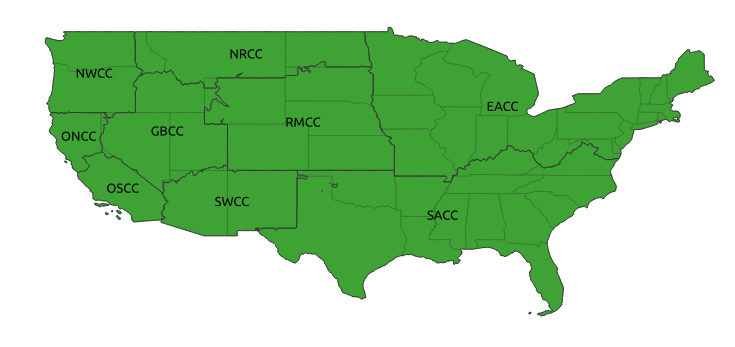]]


---
# Results 1

.center[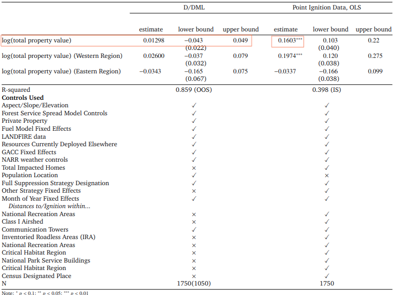]

---
# What does the kernel Look Like?

Pretty hard to figure out, with as many inputs as we have, what actually matters.

--

Harder still - these functions are not linear. How do we get interpretable 'coefficient equivalents'? How about partial gradients?

$$\hat{\beta}_{nonlin} \equiv \frac{\partial f}{\partial X_i}*X_i$$

Shown: good performance across interpretability metrics in lab settings.

However - if we have very 'flat' gradients...

$$\frac{\partial f}{\partial X_i} \approx 0$$ 

...we only have local information about the activation 

- could be flat because at peak of mountain (meaning it's really important to the function) or may be flat everywhere.

---
# Kernel, improved

<br><br><br><br>

Good news: Because Neural Networks are differentiable everywhere, I can use a very cool tool to explore what I'm controlling for in full.

Known as 'integrated gradients' essentially it calculates an approximate Riemann sum of gradients to get true conditional value, following the Gauss-Legendre formula.

---
# Visualizing the Kernel

<br><br>

$$IG := (x_i - x_i') \times \int^1_{\alpha = 0}\frac{\partial NN(x_i' + \alpha*(x_i - x_i'))}{\partial x_i}$$
Where $x_i$ is an image, but practically speaking could be as fine-grained as a single channel-pixel.

--

This buys me an 'explainability' map over the features I put into the CCT, and allows me to point you directly at what the meta-learner uses to adjust treatment propensity and outcome level.

---
# Kernel
.center[**Holiday Farm Fire:** NLCD Impermeability metric]

.center[]

---
# Kernel
.center[**Holiday Farm Fire:** NLCD Impermeability metric (point of ignition)]

.center[]

---
# Kernel
.center[**Holiday Farm Fire:** NLCD Impermeability metric]

.center[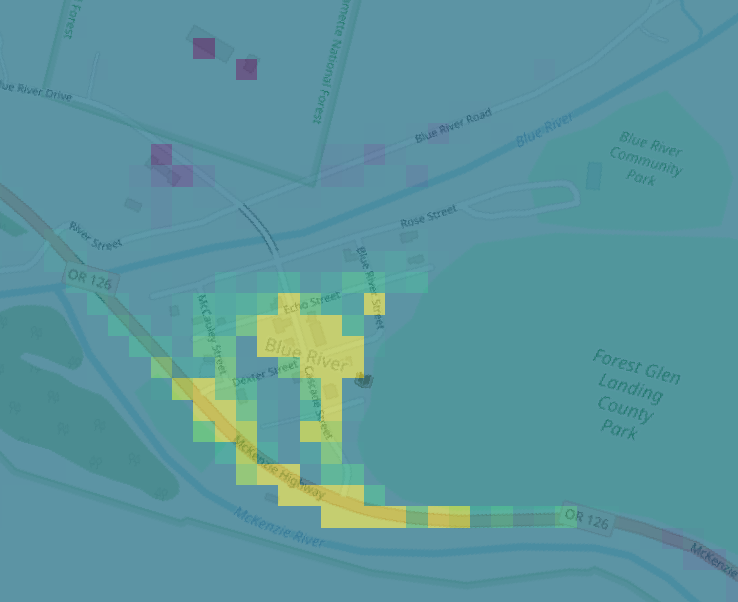]

---
# Kernel
.center[**Holiday Farm Fire:** NLCD Impermeability metric]

.center[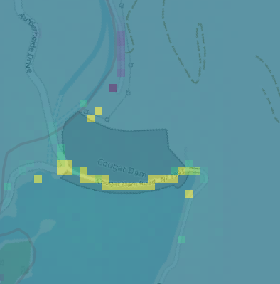]

---
# Kernel
.center[**Holiday Farm Fire:** NLCD Impermeability metric]

.center[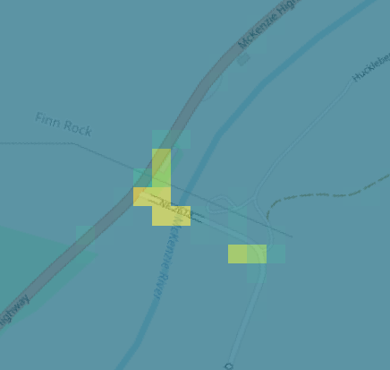]

---
# Kernel: Utah
.center[**Range Fire:** NLCD Impermeability metric]


.center[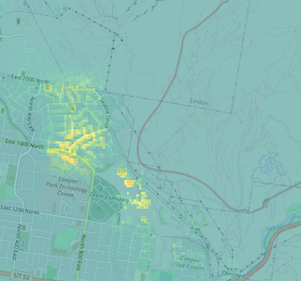]


---
# Kernel: Utah
.center[**Range Fire:** Slope DEM metric]


.center[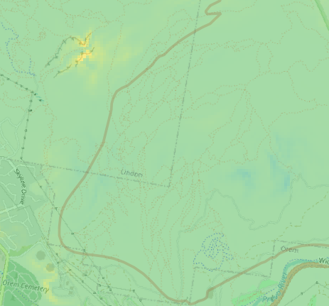]


---
# Results 2

.hi[Q] Can we improve on predictions for SCI?

--

.hi[A] Yes! $R^2 = .91$ for all fires, $R^2 = .93$ out of sample for fires with available cost forecasts. Compare to $R^2 =.63$ for predictions produced with final fire boundaries and $R^2 = .16$ for original estimates from SCI.

--

.hi[A.sub[2]] But also, does so with less correlation to nearby property values and income. Using Forest Service projections for final suppression costs and comparing to correlation across costs from my model...

$$Corr(\widehat{fire\ cost}_{SCI}, summed\ income) \approx .09$$
$$Corr(\widehat{fire\ cost}_{NN}, summed\ income) \approx .03$$
More work needs to be done, but this is very promising.

---
# New Method

To evaluate whether cost monitoring has made fire managers more sensitive to nearby property value is difficult, but we have one 'natural experiment' we can work with.

**Fact:** fires under 300 acres in size cannot have cost estimates produced for them $\rightarrow$ discontinuous jump in auditing probability at 300 acres.

--

.center[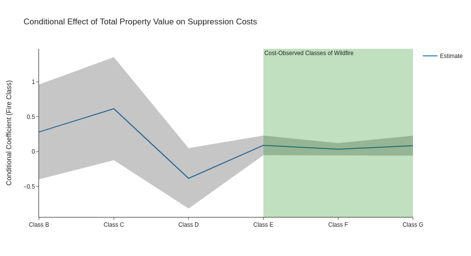]


---
# New Method

<br><br><br>

**Idea: RDD+** Train two quartets of NN on unmonitored/monitored fires less than 1000 acres in size, and then test for equal **D/DML** estimates of $\theta$ on either side of the 300 acre mark.

--

Results - using a kernel ignoring fires just over the boundary

-2.88 vs. -1.08

$P(H_0: \theta_{unm} = \theta_{mon}; \hat{\theta}_{unm}, \hat{\theta}_{mon}) \approx .02$.

---
# New Method: Efficiency of Monitoring

**Idea: RDD+** What does a lowess version, testing discontinuity of total cost look like?

--

.cent[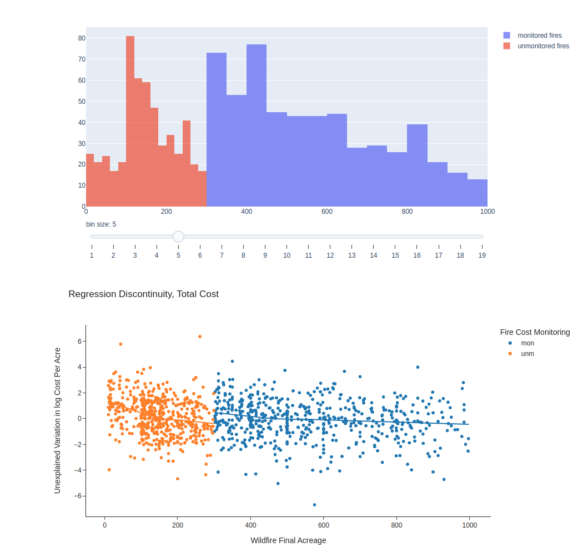]

---
# Huge Caveat

<br><br>

All results thus far are technically conditioning on an outcome, as acres are potentially an outcome of suppression effort.

Steps taken to mitigate:

- Ignore fires which had resources deployed to them after the first acreage number was reported
 
- Focus on fires both close to the cutpoint and further away (donut RDD and donut-hole RDD)

--

The coefficients describing sensitivity to property values are somewhat dependent on the bandwidth around the 300 acre cutpoint, but direction of the effect stays the same.

---
# Conclusion

**What can we take from this**

Much work has been done in machine learning allowing for more flexible methods to be utilized. There's no real reason to use linear regression for a nonlinear prediction task anymore.

--

Property values appear to largely show up as significant in suppression costs due to correlation between strategic concerns and amenities. This makes them phenomenal proxies for strategic decisions in wildfire management.

--

By including property value in our prediction pipeline directly, there is evidence that fire managers have been incentivized to artificially-prioritize property value in response to the possibility of an audit.

---
# Thank you!

---
# Sources

---
# DAG-work

.center[]

---
# DAG-work 2

.center[]

---
# Why 'Acres'/'Perimeter' is Bad Control

.center[]
---

```{R, print pdfs, echo = F, eval = T}
pagedown::chrome_print(input = "Slides-JMP.html", output = 'SCI-slides-newest-03012022.pdf')
```

