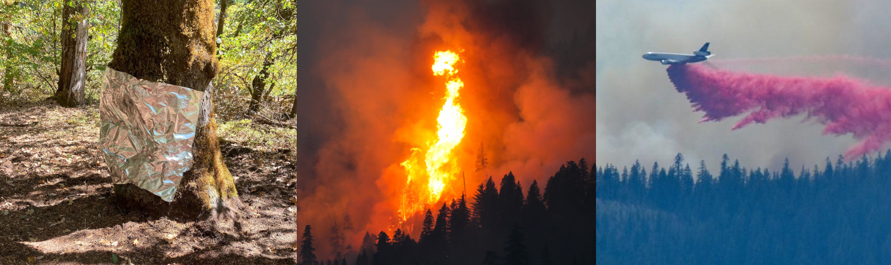

exclude: true
#class: inverse, middle


```{r Setup, include = F}
options(htmltools.dir.version = FALSE)
library(pacman)
p_load(leaflet, ggplot2, ggthemes, viridis, dplyr, magrittr, knitr, gapminder, av, gganimate(), emo, ggdag, dagitty, data.table)
# Define pink color
#red_pink <- "#e64173"
#red_pink <- "#e64173"
turquoise <- "#20B2AA"
orange <- "#FFA500"
red <- "#fb6107"
blue <- "#f92772"
green <- "#8bb174"
grey_light <- "grey70"
grey_mid <- "grey50"
grey_dark <- "grey20"
purple <- "#6A5ACD"
slate <- "#314f4f"
# Notes directory
dir_slides <- "/Users/connor/Desktop/GithubProjects/Econometrics/EC421/Spring2021/LectureNotes/01-intro/"
# Knitr options
opts_chunk$set(
  comment = "#>",
  fig.align = "center",
  fig.height = 7,
  fig.width = 10.5,
  # dpi = 300,
  # cache = T,
  warning = F,
  message = F
)

opts_chunk$set(dev = "svg")
```

```{css, echo = F}
@media print {
  .has-continuation {
    display: block !important;
  }
}
```

---
class: clear



<!--.center[.smaller[*McCash fire, threatening California Seqouia: Inciweb, September 16, 2021*]]-->

.center[Over the last ten years, the US spent .hi-orange[$21.4 billion] on fire suppression] 

.center[.smaller[Increasing number of homes are being built in the .hi[W]ildland .hi[U]rban .hi[I]nterface (.hi[WUI])]]

```{r, echo = F, fig.height = 3.8, fig.width = 12}
p_load(magrittr, patchwork)

dfwui = data.frame(wui = c(30782682, 36946860, 43434112), years = c(1990,2000,2010))

dffs = data.frame(fs_cost = c(397952000,206120000,377466000,240436000,918335000,477126000,701183000,284148000, 416704000,515516000,1410802000,952696000,1674040000,1327138000,1007244000, 818954000, 1704477000, 1620145000,1585856000,920529000,809499000,1374525000), years = c(1990:2011))

dfwui %<>% mutate(wui_nrm = (wui - mean(wui))/sd(wui), wuith = wui/100000)
dffs %<>% mutate(fs_cost_nrm = (fs_cost - mean(fs_cost))/sd(fs_cost), fsth = fs_cost/1000000)

p1 = ggplot(data = dffs, aes(x = years, y = fsth)) + geom_line(aes(colour = 'Total Fire Suppression'))  + theme_minimal()+ scale_y_continuous(name =  '', labels = scales::dollar_format()) + labs(x = '') + scale_color_manual(name = '', label ='Total Fire Suppression (millions)', values = "#db9200") + geom_hline(color = 'black', yintercept = -1.5) + geom_vline(color = 'black', xintercept = 1990) + theme(legend.text = element_blank(), legend.position = "none")+ labs(title ="Total Fire Suppression (millions)") +theme(title =  element_text("Total Fire Suppression (millions)",color = "#db9200", size = 12),
    axis.title.y = element_text(color = "#db9200", size=12, vjust = 1, hjust = 8, angle = 0),
    
  )
                                                                                                                                                        
p2 = ggplot(data = dfwui, aes(x = years, y = wuith)) + geom_line(aes(colour ='Homes in WUI (Normalized)')) + theme_minimal() +scale_y_continuous(name =  '', labels = scales::label_comma(), limits = c(300,450))+ labs(x = '')+ scale_color_manual(name = '', label ='Wui Homes (100,000s)', values = '#027802')+ geom_hline(color = 'black', yintercept = 300) + geom_vline(color = 'black', xintercept = 1990) + theme(legend.text = element_blank(), legend.position = "none")+ labs(title ="Homes in WUI (100,000s)") +theme(title = element_text("Homes in WUI (100,000s)",color = '#027802', size = 12),
    axis.title.y = element_text(color = '#027802', size=12, vjust = 1, hjust = 8, angle = 0),
    )                


p3 = ggplot(data = dffs, aes(x = years, y = fsth)) + geom_line(aes(colour = 'Total Fire Suppression')) + geom_line(data = dfwui, aes(y = wuith, colour ='Homes in WUI (Normalized)')) + theme_minimal()+ scale_y_continuous(name =  'Total Fire Suppression (millions)', labels = scales::dollar_format(), sec.axis = sec_axis(name ='Homes in WUI (100,000s)', trans=~.*(1/10), labels = scales::label_comma())) + labs(x = 'Year') + scale_color_manual(name = '', labels =c('Total Fire Suppression (millions)', 'WUI homes (100,000s)'), values = c('#027802', "#db9200")) + geom_hline(color = 'black', yintercept = -1.5) + geom_vline(color = 'black', xintercept = 1990) + theme(legend.text = element_blank(), legend.position = "none")+theme(
    axis.title.y = element_text(color = "#db9200", size=12, vjust = .2, hjust = 8, angle = 0),
    axis.title.y.right = element_text(color = '#027802', size=12, vjust = .2, hjust = -3, angle = 0)
  )

p1 + p2
#p1
#axis.title.y.right = element_text(color = '#027802', size=12, vjust = 0, hjust = -3, angle = 0)
#sec.axis = sec_axis(name ='Homes in WUI (100,000s)', trans=~.*(1/10), labels = scales::label_comma())                                                                                                                                                                                                                                                                    #caption = "WUI: Wildland Urban Interface. \n Fire suppression data from NIFC \n Home-ownership data from Radeloff et al. (2019) supplemental content") 
```

---
# [2] What is .hi-orange[causing] these higher costs?

What causes fires to be __more__ or __less__ expensive to suppress in the first place?

Major policy concern: association between .hi[property values] and .hi-orange[expense of fire suppression] (observed by existing literature) $\rightarrow$ __regressive!__

Is this association due to a bias towards protecting wealth directly or due to expensive homes being built in places that are expensive to fight fires?

.pull-right[ __Complication: Dynamic expectations__. Which paths a fire could take impact expected costs. Suppression decisions impact actual paths AND costs. Expected paths affect suppression decisions, homes at risk, and costs. **Simultaneity** problem arises if statistically analyzed ex-post, but disappears if examined using ex-ante data.]

.pull-left[
```{r, echo = F}
p_load(magrittr, scico)

df = data.frame(x = c(0:5), y = c(0:5))
                
paths = data.frame(p1x = c(2.5,2.5,3,3), p1y = c(2.5,3,4,5), p2x = c(2.5,1,0,0), p2y = c(2.5,2.5,1,1), p3x = c(2.5,3.5,4.5,4.5), p3y = c(2.5,1,0,0))

ggplot(data = df, aes(x = x, y = y)) + geom_rect(xmin = 2.25, xmax = 2.75, ymin = 2.25, ymax = 2.75, fill = orange, alpha = .3) + geom_rect(xmin = 1.00, xmax = 1.9, ymin = 1, ymax = 2.1, fill = green, alpha = .3) +  geom_label(x = 1.45, y = 1.55, label = 'W.U.I.', color = green) +  geom_rect(xmin = 0, xmax = 5, ymin = 0, ymax = 5, fill = 'dark grey', color = 'grey', alpha = .01) + geom_path(data = paths, aes(x = p1x, y = p1y, color = 'Suppression = $10,000'), size = 4) + geom_path(data = paths, aes(x = p2x, y = p2y, color = 'Suppression = $1,000,000'), size = 4) + geom_path(data = paths, aes(x = p3x, y = p3y, color = 'Suppression = $100,000'), size = 4) + theme_minimal()+ scale_y_discrete() + scale_x_discrete() + labs(title = 'Potential Fire Paths', subtitle = 'Effect on suppression expenditure', y = "", x = '', caption = "Orange square is ignition location \n Green rct. represents WUI neighborhood \n lines represent potential fire paths") + scale_color_scico_d(name = '', labels = c('Fire path 1: Suppression = $1,000,000','Fire path 2: Suppression = $10,000' , 'Fire path 3: Suppression = $100,000'), palette = "roma") + theme(legend.text=element_text(size=15), plot.caption = element_text(size = 15), plot.title= element_text(size = 15), plot.subtitle = element_text(size = 12))
#values=c('#24E0A3','#E04524', 'grey'))
```
]

---
# [3] Outline

__Research goal:__ .smaller[Decompose the fire manager's problem to identify:]

__1:__ .smaller[Do fire managers preferentially assign more resources to fires near expensive properties?]

__2:__ .smaller[How much of this correlation between fire suppression and property values is due to physical attributes common to expensive properties and higher suppression costs?]

__Note:__ .smaller[Could be a combination of both!]

.smaller[.hi-black[Methods]]: .smaller[Double/Debiased Machine Learning]

- .smaller[Uses .hi-black[C]ompact .hi-black[C]onvolutional .hi-black[T]ransformer (.hi-black[CCT]), to model nonlinear confounders in a regression model (e.g., Slope, Fuels, Canopy Cover, Accessibility ...)]

- .smaller[Produces causal estimates of property value on fire suppression costs, controlling for machine-learned fire risk attributes]

---
# [4] Causal System

### Research Question

<!--.center[.smaller[.hi-orange[P.V]: Property Values| .hi-orange[Supp]: Suppression Costs| .hi-orange[Envir]: Environment| 
.hi-orange[Amnty]: Amenities| .hi-orange[FireRsk] : Fire Risk|.hi-orange[Ex.Supp]: Expected Suppression Costs]]-->

```{r, prob, include = F}
# The full DAG
p_load(dagitty, dagify)
ex5 = dagify(
  Suppression ~ PropertyValues,
  coords = tibble(
    name = c("Suppression", "PropertyValues", "FireRisk", "Amenities", "Environment"),
    x = c(0, 2, 0, 2, 1),
    y = c(0, 0, 2, 2, 2)
  )
)

ex5_5 = dagify(
  Suppression ~ PropertyValues,
  Amenities ~ Environment,
  PropertyValues~ Amenities,
  coords = tibble(
    name = c("Suppression", "PropertyValues", "FireRisk", "Amenities", "Environment"),
    x = c(0, 2, 0, 2, 1),
    y = c(0, 0, 2, 2, 2)
  )
)
# Convert to data.table
ex5_5 %<>% fortify() %T>% setDT()
# Shorten segments
mult = 0.2
ex5_5[, `:=`(
  xa = x + (xend-x) * (mult),
  ya = y + (yend-y) * (mult),
  xb = x + (xend-x) * (1-mult),
  yb = y + (yend-y) * (1-mult)
)]

# Convert to data.table
ex5 %<>% fortify() %T>% setDT()
# Shorten segments
mult = 0.2
ex5[, `:=`(
  xa = x + (xend-x) * (mult),
  ya = y + (yend-y) * (mult),
  xb = x + (xend-x) * (1-mult),
  yb = y + (yend-y) * (1-mult)
)]
```

<!--<hr style="height:2px; visibility:hidden;" />-->


```{r, probfig, echo = F, fig.height = 5, fig.width = 7}
ggplot(
  data = ex5_5,
  aes(x = x, y = y, xend = xend, yend = yend)
) +
geom_point(
  data = ex5,
  size = 28,
  fill = "white",
  color = slate,
  shape = 21,
  stroke = 0.6
) +
geom_curve(
  data = ex5,
  aes(x = xa, y = ya, xend = xb, yend = yb),
  curvature = 0,
  arrow = arrow(length = unit(0.07, "npc")),
  color = slate,
  size = .8,
  lineend = "round"
) +
  geom_curve(data = ex5_5,
  aes(x = xa, y = ya, xend = xb, yend = yb),
  curvature = 0,
  arrow = arrow(length = unit(0.14, "npc")),
  color = 'white',
  alpha = 0.005,
  size = .8,
  lineend = "round"
) +
  geom_point(
  data = ex5_5,
  size = 28,
  fill = "white",
  color = slate,
  shape = 21,
  stroke = 0.6,
  alpha = 0.001
) +
geom_text(
  data = ex5 %>% .[,.(name,x,y,xend=x,yend=y)] %>% unique(),
  aes(x = x, y = y, label = name),
  family = "Fira Sans Medium",
  size = 3,
  color = red
) +
theme_void() +
theme(
  legend.position = "none",
) +
coord_cartesian(
  xlim = ex5_5[,range(x)] + ex5_5[,range(x) %>% diff()] * c(-0.08, 0.08),
  ylim = ex5_5[,range(y)] + ex5_5[,range(y) %>% diff()] * c(-0.08, 0.08)
)
```

---
# [4] Causal System

### Basic Hedonics

<!--.center[.smaller[.hi-orange[P.V]: Property Values| .hi-orange[Supp]: Suppression Costs| .hi-orange[Envir]: Environment| 
.hi-orange[Amnty]: Amenities| .hi-orange[FireRsk] : Fire Risk|.hi-orange[Ex.Supp]: Expected Suppression Costs]]-->

<!--<hr style="height:2px; visibility:hidden;" />-->

```{r, prob2, include = F}
# The full DAG
p_load(dagitty, dagify)
ex5 = dagify(
  Suppression ~ PropertyValues,
  Amenities ~ Environment,
  PropertyValues~ Amenities,
  coords = tibble(
    name = c("Suppression", "PropertyValues", "FireRisk", "Amenities", "Environment"),
    x = c(0, 2, 0, 2, 1),
    y = c(0, 0, 2, 2, 2)
  )
)
# Convert to data.table
ex5 %<>% fortify() %T>% setDT()
# Shorten segments
mult = 0.2
ex5[, `:=`(
  xa = x + (xend-x) * (mult),
  ya = y + (yend-y) * (mult),
  xb = x + (xend-x) * (1-mult),
  yb = y + (yend-y) * (1-mult)
)]
```

```{r, prob2fig, echo = F, fig.height = 5, fig.width = 7}
ggplot(
  data = ex5,
  aes(x = x, y = y, xend = xend, yend = yend)
) +
geom_point(
  size = 28,
  fill = "white",
  color = slate,
  shape = 21,
  stroke = 0.6
) +
geom_curve(
  aes(x = xa, y = ya, xend = xb, yend = yb),
  curvature = 0,
  arrow = arrow(length = unit(0.07, "npc")),
  color = slate,
  size = .8,
  lineend = "round"
) +
geom_text(
  data = . %>% .[,.(name,x,y,xend=x,yend=y)] %>% unique(),
  aes(x = x, y = y, label = name),
  family = "Fira Sans Medium",
  size = 3,
  color = red
) +
theme_void() +
theme(
  legend.position = "none",
) +
coord_cartesian(
  xlim = ex5[,range(x)] + ex5[,range(x) %>% diff()] * c(-0.08, 0.08),
  ylim = ex5[,range(y)] + ex5[,range(y) %>% diff()] * c(-0.08, 0.08)
)
```
---
# [4] Causal System

### Basic Physics

<!--.center[.smaller[.hi-orange[P.V]: Property Values| .hi-orange[Supp]: Suppression Costs| .hi-orange[Envir]: Environment| 
.hi-orange[Amnty]: Amenities| .hi-orange[FireRsk] : Fire Risk|.hi-orange[Ex.Supp]: Expected Suppression Costs]]-->

```{r, prob3, include = F}
# The full DAG
p_load(dagitty, dagify)
ex5 = dagify(
  Suppression ~ PropertyValues,
  Suppression ~ FireRisk,
  FireRisk ~ Environment,
  Amenities ~ Environment,
  PropertyValues~ Amenities,
  coords = tibble(
    name = c("Suppression", "PropertyValues", "FireRisk", "Amenities", "Environment"),
    x = c(0, 2, 0, 2, 1),
    y = c(0, 0, 2, 2, 2)
  )
)
# Convert to data.table
ex5 %<>% fortify() %T>% setDT()
# Shorten segments
mult = 0.2
ex5[, `:=`(
  xa = x + (xend-x) * (mult),
  ya = y + (yend-y) * (mult),
  xb = x + (xend-x) * (1-mult),
  yb = y + (yend-y) * (1-mult)
)]
```

```{r, prob3fig, echo = F, fig.height = 5, fig.width = 7}
ggplot(
  data = ex5,
  aes(x = x, y = y, xend = xend, yend = yend)
) +
geom_point(
  size = 28,
  fill = "white",
  color = slate,
  shape = 21,
  stroke = 0.6
) +
geom_curve(
  aes(x = xa, y = ya, xend = xb, yend = yb),
  curvature = 0,
  arrow = arrow(length = unit(0.07, "npc")),
  color = slate,
  size = .8,
  lineend = "round"
) +
geom_text(
  data = . %>% .[,.(name,x,y,xend=x,yend=y)] %>% unique(),
  aes(x = x, y = y, label = name),
  family = "Fira Sans Medium",
  size = 3,
  color = red
) +
theme_void() +
theme(
  legend.position = "none",
) +
coord_cartesian(
  xlim = ex5[,range(x)] + ex5[,range(x) %>% diff()] * c(-0.08, 0.08),
  ylim = ex5[,range(y)] + ex5[,range(y) %>% diff()] * c(-0.08, 0.08)
)
```

---
# [4] Causal System

### Fire Manager's Expectation/Information (Unobserved)

<!--.center[.smaller[.hi-orange[P.V]: Property Values| .hi-orange[Supp]: Suppression Costs| .hi-orange[Envir]: Environment| 
.hi-orange[Amnty]: Amenities| .hi-orange[FireRsk] : Fire Risk|.hi-orange[Ex.Supp]: Expected Suppression Costs]]-->


```{r, prob4, include = F}
# The full DAG
p_load(dagitty, dagify)
ex5 = dagify(
  Suppression ~ PropertyValues,
  Suppression ~ FireRisk,
  FireRisk ~ Environment,
  Amenities ~ Environment,
  PropertyValues ~ Amenities,
  Ex.Suppression ~PropertyValues,
  Ex.Suppression ~ FireRisk,
  Ex.Suppression ~ Amenities,
  Ex.Suppression ~ Environment,
  Suppression ~ Ex.Suppression,
  coords = tibble(
   name = c("Suppression", "PropertyValues", "FireRisk", "Amenities", "Environment", "Ex.Suppression"),
    x = c(0, 2, 0, 2, 1, 1),
    y = c(0, 0, 2, 2, 2, .85)
  )
)
# Convert to data.table
ex5 %<>% fortify() %T>% setDT()
# Shorten segments
mult = 0.2
ex5[, `:=`(
  xa = x + (xend-x) * (mult),
  ya = y + (yend-y) * (mult),
  xb = x + (xend-x) * (1-mult),
  yb = y + (yend-y) * (1-mult)
)]
```

```{r, prob4fig, echo = F, fig.height = 5, fig.width = 7}
ggplot(
  data = ex5,
  aes(x = x, y = y, xend = xend, yend = yend)
) +
geom_point(
  size = 28,
  fill = "white",
  color = slate,
  shape = 21,
  stroke = 0.6
) +
geom_curve(
  aes(x = xa, y = ya, xend = xb, yend = yb),
  curvature = 0,
  arrow = arrow(length = unit(0.07, "npc")),
  color = slate,
  size = .8,
  lineend = "round"
) +
geom_text(
  data = . %>% .[,.(name,x,y,xend=x,yend=y)] %>% unique(),
  aes(x = x, y = y, label = name),
  family = "Fira Sans Medium",
  size = 3,
  color = red
) +
theme_void() +
theme(
  legend.position = "none",
) +
coord_cartesian(
  xlim = ex5[,range(x)] + ex5[,range(x) %>% diff()] * c(-0.08, 0.08),
  ylim = ex5[,range(y)] + ex5[,range(y) %>% diff()] * c(-0.08, 0.08)
)
```

---
class: clear

.hi[&#x2611;] .smallest[.smallest[.hi-black[Goal:]]] .smallest[.smallest[To disentangle physical components of expected fire suppression costs and amenities from a tendency to protect expensive property. Use models of fire spread and risk of damage to assets that fire managers expect to protect in order to identify important control variables - elevation, fuels, water-features, telephone, etc].]

.smallest[.smallest[**D/DML** uses out-of-sample estimates from two .hi-black[CCT] models performing nonlinear regressions of Property Values and Suppression Costs]] $\scriptsize f(\cdot), g(\cdot)$ .smallest[.smallest[respectively, using the control variable set]] $\scriptsize X_i$ .smallest[.smallest[for each]]. .smallest[.smallest[For fire]] $\scriptsize i$ .smallest[.smallest[:]]


$$\small log(Suppression\ Costs_i) = \theta log(Property\ Values_i) + g(X_i) + u_i\ \ \ (1)$$

$$\small log(Property\ Values_i) = f(X_i) + v_i\ \ \ (2)$$

<!--$$\small \theta \equiv param\ of\ interest, \ X \equiv \{Rsk, Envr, Amn, Ex.Supp\}, \eta \equiv\{f(X_i),g(X_i)\}$$-->

.smallest[.smallest[Estimating]] $\small \theta$ .smallest[.smallest[with linear estimators in this system of equations produces estimation error in]] $\scriptsize f$ .smallest[.smallest[in equation (2) that ]] .smallest[.smallest[may produce bias. For D/DML estimation to yield valid causal estimates, two assumptions are required:]]

.smallest[.smallest[__A<sub>1</sub>__]] $\scriptsize u_i$ .smallest[.smallest[ and ]] $\scriptsize v_i$ .smallest[.smallest[exist, are additively separable from]] $\scriptsize g,\ f$ .smallest[.smallest[ and are unassociated to one another]]. .smallest[.smallest[I.e - unlearnable non-physical factors in property values (eg, interest rates at valuation time) are not associated with non-physical factors in fire-level suppression (eg, changes in wind speed during burn) except via changes in property values.]]

.smallest[.smallest[__A<sub>2</sub>__]] $\scriptsize  \sum_{i\in N}(\hat{g}(X_i) - g(X_i))(\hat{f}(X_i) - f(X_i))$ .smallest[.smallest[converges at rate]] $\scriptsize \sqrt{N}$, .smallest[.smallest[or that either estimation error converges at least at rate]] $\scriptsize \sqrt[4]{N}$ . .smallest[.smallest[This assumes the estimation errors of]] $\scriptsize \hat{f}$ .smallest[.smallest[ and ]]  $\scriptsize \hat{g}$ .smallest[.smallest[are not systematically associated or .hi-black[CCT] is a reasonable estimator for]] $\scriptsize f\ \text{or}\ g$ .smallest[.smallest[, and that]] $\scriptsize X_i$ .smallest[.smallest[does not contain any bad controls]]


---
# Nascent Results

My estimates indicate a smaller effect from property values on suppression costs than existing literature: for a .hi[1% increase in property values], costs .hi-orange[increase by .038%]. Compares to .hi-slate[reported .11%] increase in Gebert et al. 2007 (SCI) and .hi-slate[a .16% increase] when replicating SCI on data from 2020-2021. This difference is statistically significant.

---
exclude: true

.smallest[**Assume** errors exist &] .smallest[ are additively separable in log-log form] 


.smallest[.smallest[Prelim results: Estimate for the effect of = .smallest[.smallest[.hi-orange[.03817], 95% - CI = .hi-orange[[-.02577, .1021]] vs. Gebert et. al, 2007 OLS estimate of .hi-slate[.1131], (CI unknown). Repeating Gebert et al. procedure on fire expenditures data from 2020-2021 -] .smallest[[estimate = .hi-slate[.1606], CI = .hi-slate[[0.0973, 0.223908]]]]]


```{R, print pdfs, echo = F, eval = T}
pagedown::chrome_print(input = "actual-5-slide-deck-SCI-2-nopause.html", output = 'Lennon_SCI_5-slide-deck_09292021.pdf')
```

